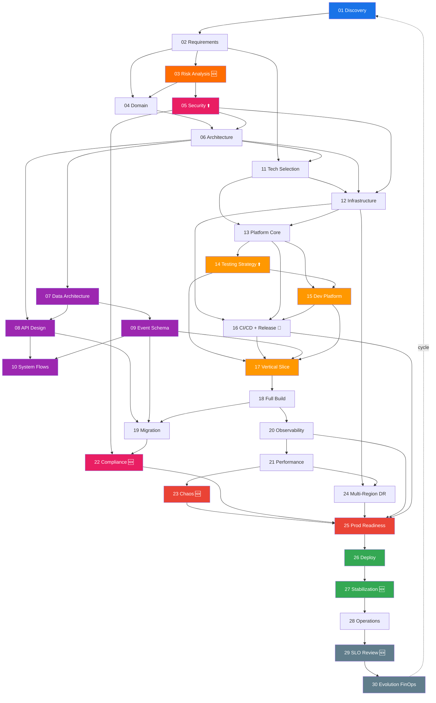

# BigTech System Development Lifecycle — Master Workflow

> **30 phases** organized into **8 stages**, reflecting how Amazon, Google, Netflix, Uber, and Stripe build distributed systems.
> Generic and reusable for: E-commerce, Payments, Ride-hailing, Social Networks, Streaming, Banking.

> [!CAUTION]
> Execute phases in order. Approval gate between every phase.
> **Documentation FIRST → Architecture FIRST → Infrastructure FIRST → Platform FIRST → Code LAST.**

---

## 8 Stages × 30 Phases

### Stage A — Discovery & Requirements

| # | Phase | Goal | Key Output |
|---|-------|------|------------|
| 01 | Product Discovery | Understand problem, users, MVP scope | Vision, personas, KPIs |
| 02 | Requirements & SLOs | Functional + non-functional requirements | User stories, NFRs, traffic model, SLOs |
| 03 | **Risk Analysis & Threat Modeling** 🆕 | Identify risks, threats, compliance needs early | Risk register, STRIDE model, compliance map |

### Stage B — Domain & Architecture

| # | Phase | Goal | Key Output |
|---|-------|------|------------|
| 04 | Domain Design | Bounded contexts via Event Storming | Contexts, aggregates, events, data ownership |
| 05 | **Security Architecture** ⬆️ | Security-by-design (shifted left earlier) | Auth flows, RBAC, encryption, WAF, audit |
| 06 | High-Level Architecture | System shape, service catalog, resilience | Architecture diagram, service catalog, resilience patterns |
| 07 | Data Architecture | Data models, storage strategy, data flows | Schema designs, data flow diagrams, partition strategy |
| 08 | API Design — Contract First | Define ALL APIs before implementation | OpenAPI specs, gRPC protos, API versioning strategy |
| 09 | Event Schema & Governance | Event catalog, schema evolution, governance | Event envelope, topic catalog, schema registry |
| 10 | System Flows | 14+ end-to-end flow diagrams | Request, auth, event, saga, error, retry, DLQ, cache, search, upload, notification, payment, deploy, observability flows |
| 11 | Technology Selection | Every tool with alternatives + trade-offs | Tech stack comparison matrix, ADRs |

### Stage C — Platform & Infrastructure

| # | Phase | Goal | Key Output |
|---|-------|------|------------|
| 12 | Infrastructure Design (IaC) | Cloud resources, networking, IAM | Terraform modules, VPC, environment strategy |
| 13 | Platform Core | Shared libraries for all services | @app/core: logger, resilience, outbox/inbox, auth, config |
| 14 | **Testing Strategy** ⬆️ | Test pyramid: unit → integration → contract → E2E → load → chaos | Test architecture, coverage targets, test infrastructure |
| 15 | Developer Platform / DX | Internal tooling, service templates, local dev | Service scaffold CLI, Docker Compose, dev environment |
| 16 | **CI/CD & Release Engineering** 🔀 | Build → test → deploy → release → rollback | Pipeline config, canary/blue-green, feature flags, release strategy |

### Stage D — Service Development

| # | Phase | Goal | Key Output |
|---|-------|------|------------|
| 17 | Vertical Slice | Prove one E2E flow works before building all | Working flow in staging (user → gateway → service → DB → event) |
| 18 | Full Implementation | Build all services tier-by-tier | Tier 1→4: Foundation → Core → Transactions → Support |
| 19 | Migration & Backward Compat | Schema evolution, data migration, API versioning | Migration playbooks, backward compat rules, feature flags |

### Stage E — Hardening

| # | Phase | Goal | Key Output |
|---|-------|------|------------|
| 20 | Observability | Logs, metrics, traces, dashboards, alerts | SLI/SLO definitions, Grafana dashboards, alert rules |
| 21 | Performance Engineering | Latency budgets, profiling, capacity planning | Performance benchmarks, capacity model, optimization plan |
| 22 | **Compliance & Data Governance** 🆕 | Regulatory validation, DPIA, data lineage | Compliance evidence, audit trail, data classification verified |
| 23 | **Chaos Engineering & Game Days** 🆕 | Resilience under failure conditions | Chaos experiment results, game day reports |
| 24 | Multi-Region & DR | Disaster recovery, failover, data replication | RTO/RPO targets, failover runbooks, DR drill procedures |
| 25 | Production Readiness | Go/no-go gate with comprehensive checklist | Load test results, security audit, chaos test, runbooks |

### Stage F — Launch

| # | Phase | Goal | Key Output |
|---|-------|------|------------|
| 26 | Deployment | Zero-downtime production launch | Deployment runbook, smoke tests, rollback verified |
| 27 | **Post-Launch Stabilization** 🆕 | Dedicated 2-week stabilization period | Stability report, P1/P2 fixes, error budget baseline |

### Stage G — Operations

| # | Phase | Goal | Key Output |
|---|-------|------|------------|
| 28 | Operations & Incident Management | On-call, incident process, SLO reviews | On-call rotation, incident process, post-mortem template |
| 29 | **SLO Review & Optimization** 🆕 | Data-driven optimization cycle | SLO attainment report, optimization backlog |

### Stage H — Evolution

| # | Phase | Goal | Key Output |
|---|-------|------|------------|
| 30 | System Evolution & FinOps | Tech debt, cost optimization, architecture evolution | Evolution roadmap, FinOps reports, v2 planning |

---

## Dependency Graph



---

## Approval Gates

| Gate Type | Description | Approvers |
|-----------|-------------|-----------|
| 📋 Document Review | Written artifact reviewed and approved | Tech Lead + 1 peer |
| 🏗️ Architecture Review | Design review board (ARB) sign-off | Staff Eng + Principal Eng |
| 🔒 Security Review | Security team sign-off | Security Engineer |
| 🧪 Quality Gate | Automated quality checks pass | CI/CD (automated) |
| 🚀 Launch Gate | Go/no-go decision | Eng Lead + Product + SRE |

| Phases | Gate Type |
|--------|-----------|
| 01–04 | 📋 Document Review |
| 05 | 🔒 Security Review |
| 06–11 | 🏗️ Architecture Review |
| 12–16 | 🧪 Quality Gate |
| 17 | 🧪 Quality Gate (E2E in staging) |
| 18 | 🧪 Quality Gate (per tier) |
| 19–24 | 🏗️ Architecture Review |
| 25 | 🚀 Launch Gate (ALL items GREEN) |
| 26 | 🚀 Launch Gate (2hr monitoring clean) |
| 27 | 📋 Document Review (stability report) |
| 28–30 | 📋 Document Review |

---

## Folder Structure

```
docs/
├── README.md                              ← Navigation index
├── stages/
│   ├── A-discovery-requirements/
│   │   ├── 01-product-discovery.md
│   │   ├── 02-requirements-slos.md
│   │   └── 03-risk-analysis.md            🆕
│   ├── B-domain-architecture/
│   │   ├── 04-domain-design.md
│   │   ├── 05-security-architecture.md    ⬆️ moved earlier
│   │   ├── 06-high-level-architecture.md
│   │   ├── 07-data-architecture.md
│   │   ├── 08-api-design.md
│   │   ├── 09-event-schema-governance.md
│   │   ├── 10-system-flows.md
│   │   └── 11-technology-selection.md
│   ├── C-platform-infrastructure/
│   │   ├── 12-infrastructure-design.md
│   │   ├── 13-platform-core.md
│   │   ├── 14-testing-strategy.md         ⬆️ moved earlier
│   │   ├── 15-developer-platform.md
│   │   └── 16-cicd-release-engineering.md 🔀 merged
│   ├── D-service-development/
│   │   ├── 17-vertical-slice.md
│   │   ├── 18-full-implementation.md
│   │   └── 19-migration-compatibility.md
│   ├── E-hardening/
│   │   ├── 20-observability.md
│   │   ├── 21-performance-engineering.md
│   │   ├── 22-compliance-data-governance.md 🆕
│   │   ├── 23-chaos-engineering.md          🆕
│   │   ├── 24-multi-region-dr.md
│   │   └── 25-production-readiness.md
│   ├── F-launch/
│   │   ├── 26-deployment.md
│   │   └── 27-post-launch-stabilization.md  🆕
│   ├── G-operations/
│   │   ├── 28-operations-incident-mgmt.md
│   │   └── 29-slo-review-optimization.md    🆕
│   └── H-evolution/
│       └── 30-system-evolution-finops.md
├── cross-cutting/
│   ├── architecture/
│   │   ├── system-overview.md             ← Phase 06
│   │   ├── architecture-diagrams.md       ← Phase 06
│   │   └── service-catalog.md             ← Phase 06
│   ├── data/
│   │   ├── data-architecture.md           ← Phase 07
│   │   └── data-governance.md             ← Phase 22 🆕
│   ├── api/
│   │   ├── api-catalog.md                 ← Phase 08
│   │   ├── api-style-guide.md             ← Phase 08
│   │   └── specs/                         ← per-service OpenAPI
│   ├── events/
│   │   ├── event-catalog.md               ← Phase 09
│   │   ├── event-flows.md                 ← Phase 09
│   │   └── schemas/                       ← per-event schemas
│   ├── security/
│   │   ├── security-architecture.md       ← Phase 05
│   │   ├── threat-model.md                ← Phase 03 🆕
│   │   └── compliance-matrix.md           ← Phase 22 🆕
│   ├── infrastructure/
│   │   ├── infrastructure-modules.md      ← Phase 12
│   │   └── cost-model.md                  ← Phase 21 🆕
│   ├── operations/
│   │   ├── observability-strategy.md      ← Phase 20
│   │   ├── scaling-strategy.md            ← Phase 21
│   │   ├── dr-strategy.md                 ← Phase 24
│   │   ├── runbooks/                      ← individual runbooks
│   │   └── incident-templates/            ← post-mortem templates
│   ├── testing/
│   │   └── testing-architecture.md        ← Phase 14
│   ├── release/
│   │   ├── ci-cd-pipeline.md              ← Phase 16
│   │   ├── deployment-flow.md             ← Phase 16
│   │   └── release-strategy.md            ← Phase 16 🆕
│   └── finops/
│       └── finops-report.md               ← Phase 30
├── adr/
│   ├── README.md                          ← ADR index (auto-generated)
│   └── ADR-NNN-*.md
├── templates/
│   ├── phase-template.md
│   ├── adr-template.md
│   ├── runbook-template.md
│   ├── post-mortem-template.md
│   └── rfc-template.md
└── generated/                             ← auto-generated docs
    ├── api-catalog.md
    ├── event-catalog.md
    ├── dependency-graph.md
    ├── coverage-report.md
    └── cost-report.md
```

---

## Phase Document Template

Every phase uses this structure:

```markdown
# Phase XX — Name
## 1. Goal
## 2. Key Decisions
## 3. Documents Produced
## 4. Architecture Artifacts
## 5. Example Deliverables
## 6. Key Questions
## 7. Implementation Tasks
## 8. Common Mistakes
## 9. KPIs & Exit Criteria
## 10. Connection to Next Phase
```

---

## Detailed Phase Descriptions

| Phases | File |
|--------|------|
| 01–10 (Discovery → Architecture) | [Phases 01–10](./build-large-system-phases-01-10.md) |
| 11–20 (Tech Selection → Observability) | [Phases 11–20](./build-large-system-phases-11-20.md) |
| 21–30 (Hardening → Operations → Evolution) | [Phases 21–30](./build-large-system-phases-21-30.md) |

---

## Quick Reference

| Need | Phases |
|------|--------|
| "What are we building?" | 01 + 02 |
| "What are the risks?" | **03 (Risk Analysis)** 🆕 |
| "What's the domain model?" | 04 |
| "How is security designed?" | **05 (Security Architecture)** |
| "What's the system shape?" | 06 |
| "How is data organized?" | **07 (Data Architecture)** |
| "What do APIs look like?" | **08 (API Design)** |
| "How do events evolve?" | **09 (Event Schema)** |
| "How do flows work E2E?" | 10 |
| "What tech stack?" | 11 |
| "How do I set up my dev env?" | **15 (Developer Platform)** |
| "How do we test?" | **14 (Testing Strategy)** |
| "How do we release?" | **16 (CI/CD & Release)** |
| "How do we migrate schemas?" | **19 (Migration)** |
| "Are we compliant?" | **22 (Compliance)** 🆕 |
| "Can it survive failures?" | **23 (Chaos Engineering)** 🆕 |
| "What if a region goes down?" | **24 (Multi-Region DR)** |
| "Is it ready for prod?" | 25 |
| "How do we stabilize?" | **27 (Stabilization)** 🆕 |
| "How are SLOs tracking?" | **29 (SLO Review)** 🆕 |
| "How much does it cost?" | **30 (FinOps)** |

---

## AI Automation Opportunities

| Automation Level | Phases |
|------------------|--------|
| 🟢 **Fully Automatable** | 07 (Data), 08 (API), 09 (Events), 12 (Infra), 13 (Platform), 14 (Testing), 15 (DX), 16 (CI/CD), 18 (Build), 19 (Migration), 20 (Observability), 26 (Deploy) |
| 🟡 **AI-Assisted** | 01, 02, 03, 04, 05, 06, 10, 11, 17, 21, 22, 23, 24, 25, 27, 28, 29, 30 |

---

## Changes from v1 (25-Phase)

| Change | Details |
|--------|---------|
| 🆕 New phases | 03 Risk Analysis, 22 Compliance, 23 Chaos Engineering, 27 Stabilization, 29 SLO Review |
| ⬆️ Moved earlier | Security (was 10 → now 05), Testing Strategy (was 15 → now 14) |
| 🔀 Merged/expanded | CI/CD + Release Engineering combined into Phase 16 |
| 📁 Stages | 7 → 8 stages (added Stage H: Evolution) |
| 📄 Phases | 25 → 30 phases |
| 🗂️ Folder structure | Grouped by stage, added cross-cutting/, templates/, generated/ |
| ✅ Gates | 5 gate types with explicit approvers per phase |
| 📊 KPIs | Exit criteria added to every phase |
