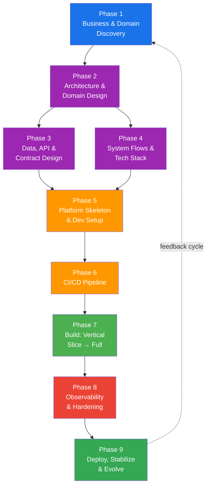

# Minimum Build System Workflow

> **9 phases** compressed from the [30-phase BigTech lifecycle](./build-large-system.md), designed for **solo developers or small teams**.
> Same architectural thinking. Same production mindset. No enterprise overhead.

> [!CAUTION]
> Execute phases in order. Approval gate between every phase.
> **Documentation FIRST → Architecture FIRST → Code LAST.**

---

## Why This Exists

The 30-phase `build-large-system` workflow models how Amazon/Google/Netflix build systems with hundreds of engineers. This compressed version keeps the **essential architectural thinking** while removing enterprise overhead that solo developers don't need.

### Compression Map

```
Original 30 Phases              Compressed 9 Phases
═══════════════════             ═══════════════════
01 Discovery        ─┐
02 Requirements      ├───→  Phase 1: Business & Domain Discovery
03 Risk Analysis    ─┘
04 Domain Design    ─┐
05 Security          ├───→  Phase 2: Architecture & Domain Design
06 Architecture     ─┘
07 Data Architecture ─┐
08 API Design         ├───→  Phase 3: Data, API & Contract Design
09 Event Schema      ─┘
10 System Flows     ─┐
11 Tech Selection    ├───→  Phase 4: System Flows & Tech Stack
12 Infrastructure   ─┘
13 Platform Core    ─┐
14 Testing Strategy  ├───→  Phase 5: Platform Skeleton & Dev Setup
15 Developer Platform─┘
16 CI/CD            ─────→  Phase 6: CI/CD Pipeline (lean)
17 Vertical Slice   ─┐
18 Full Build        ├───→  Phase 7: Build (Vertical Slice → Full)
19 Migration        ─┘
20 Observability    ─┐
21 Performance       ├───→  Phase 8: Observability & Hardening
22-25 Hardening     ─┘
26-30 Launch+Ops    ─────→  Phase 9: Deploy, Stabilize & Evolve
```

---

## 9 Phases Overview

| # | Phase | Goal | Key Output |
|---|-------|------|------------|
| 1 | Business & Domain Discovery | Understand problem, users, scope, risks | Vision, personas, NFRs, traffic model, risk register |
| 2 | Architecture & Domain Design | Design system shape, domains, security | Bounded contexts, RBAC, system diagram, ADRs |
| 3 | Data, API & Contract Design | Define all contracts before code | ER diagrams, OpenAPI specs, event schemas |
| 4 | System Flows & Tech Stack | Trace every request E2E, select technology | Flow diagrams, tech matrix, infrastructure sketch |
| 5 | Platform Skeleton & Dev Setup | Build shared foundation, dev environment | Core library, service scaffold, docker-compose, test setup |
| 6 | CI/CD Pipeline | Automated build, test, deploy | CI/CD config, deployment scripts |
| 7 | Build: Vertical Slice → Full | Prove 1 flow E2E, then build all services | Working services in staging |
| 8 | Observability & Hardening | Make system visible, measurable, resilient | Logs, metrics, traces, alerts, prod readiness |
| 9 | Deploy, Stabilize & Evolve | Ship, stabilize, establish operations | Deployment, stabilization report, v2 roadmap |

---

## Dependency Graph



---

## Approval Gates

| Gate Type | Phases | What to Check |
|-----------|--------|---------------|
| 📋 Document Review | 1, 9 | Completeness, accuracy, business alignment |
| 🏗️ Architecture Review | 2, 3, 4 | Design soundness, trade-offs, consistency |
| 🧪 Quality Gate | 5, 6, 7 | Tests pass, coverage met, CI green |
| 🚀 Launch Gate | 8 | Production readiness checklist all GREEN |

---

## Timeline Estimates

| Phase | Solo Developer | Small Team (2-3) |
|-------|---------------|-------------------|
| Phase 1: Discovery | 2-3 days | 3-5 days |
| Phase 2: Architecture | 3-5 days | 5-7 days |
| Phase 3: Contracts | 3-5 days | 5-7 days |
| Phase 4: Flows & Tech | 2-3 days | 3-5 days |
| Phase 5: Skeleton | 3-5 days | 5-7 days |
| Phase 6: CI/CD | 1-2 days | 2-3 days |
| Phase 7: Build | 2-4 weeks | 3-6 weeks |
| Phase 8: Observability | 3-5 days | 5-7 days |
| Phase 9: Deploy & Evolve | 1-2 weeks | 2-3 weeks |
| **Total** | **~6-8 weeks** | **~10-14 weeks** |

---

## Folder Structure

```
docs/
├── 01-business-domain-discovery.md       ← Phase 1
├── 02-architecture-domain-design.md      ← Phase 2
├── 03-data-api-contract-design.md        ← Phase 3
├── 04-system-flows-tech-stack.md         ← Phase 4
├── 05-platform-skeleton.md              ← Phase 5
├── 06-cicd-pipeline.md                  ← Phase 6
├── 07-build-implementation.md           ← Phase 7
├── 08-observability-hardening.md        ← Phase 8
├── 09-deploy-stabilize-evolve.md        ← Phase 9
├── adr/                                 ← Architecture Decision Records
│   └── ADR-NNN-*.md
└── cross-cutting/                       ← Shared artifacts
    ├── api/specs/                       ← OpenAPI specs
    ├── events/schemas/                  ← Event schemas
    └── operations/runbooks/             ← Operational runbooks
```

---

## Phase Document Template

Every phase uses this structure:

```markdown
# Phase XX — Name
## 🎯 Goal
## 📥 Input
## ⚙️ What to Do (step-by-step)
## 📤 Output (artifact)
## ✅ Done Criteria
## 🧠 What to Pay Attention To
## ⚠️ Common Mistakes
## 🏗️ Mental Model
## Connection to Next Phase
```

---

## Detailed Phase Descriptions

---

# ═══════════════════════════════════════
# UNDERSTANDING (Phases 1-4)
# "Think before you build"
# ═══════════════════════════════════════

# PHASE 1 — BUSINESS & DOMAIN DISCOVERY

> Merges: Phase 01 (Product Discovery) + Phase 02 (Requirements & SLOs) + Phase 03 (Risk Analysis)

## 🎯 Goal

Deeply understand WHAT you're building, WHO you're building it for, WHY it matters, and WHAT can go wrong — before touching any architecture or code.

## 📥 Input

- Business idea or existing product spec
- Stakeholder interviews / product briefs
- Competitive analysis (if available)
- Regulatory context (PCI-DSS, GDPR, HIPAA)

## ⚙️ What to Do

1. **Write a 1-page Vision Statement**
   - What problem? Who are the users? Why now?
   - 2-3 sentences max. If you can't explain it simply, you don't understand it.

2. **Define 3-5 Core User Journeys**
   - Map happy paths AND error paths
   - Example: "User searches → selects product → adds to cart → checks out → receives confirmation"
   - Include admin/ops flows (they always get forgotten)

3. **Create MVP In/Out Scope**
   - Two-column table: IN for v1, OUT for v2+
   - Be ruthless. If in doubt, it's OUT.

4. **Define Non-Functional Requirements (NFRs)**
   - Availability target (99.9%? 99.99%?)
   - Latency targets: p50, p95, p99
   - Expected throughput (RPS at peak)
   - Data volume: storage projection 1yr, 3yr
   - Consistency model per feature (strong vs eventual)

5. **Back-of-Envelope Traffic Estimation**
   - DAU × actions/day ÷ 86,400 = RPS
   - Apply 10x peak multiplier (Black Friday, viral moments)
   - Estimate storage: records × avg_size × retention_period

6. **Risk Register (TOP 10)**
   - For each: probability (1-5) × impact (1-5) = priority
   - Technical risks: scalability cliffs, single points of failure
   - Business risks: vendor lock-in, compliance deadlines
   - Security risks: attack surfaces, PII exposure

## 📤 Output (Artifact)

`docs/01-business-domain-discovery.md` containing:
- Vision statement
- User personas & journeys (3-5 with error paths)
- MVP in/out scope
- NFR matrix (8 dimensions)
- Traffic estimation model (RPS, storage, peak)
- SLO table (per journey)
- Risk register (top 10, scored)

## ✅ Done Criteria

| Criterion | Target |
|-----------|--------|
| Vision is 1 page, clear, approved | ✅ sign-off |
| ≥ 3 user journeys with error paths | 100% coverage |
| MVP scope has explicit IN/OUT list | Reviewed and approved |
| All NFR dimensions documented | 8/8 dimensions |
| Traffic model has RPS + storage + peak | Validated |
| Top 10 risks scored and triaged | All have mitigation plan |

## 🧠 What to Pay Attention To

- **Think in user journeys, not features.** A "feature list" doesn't tell you how the system flows. Journeys do.
- **NFRs drive architecture.** "99.99% availability" implies multi-region. "100ms p99 latency" implies caching. These are not optional nice-to-haves — they're the foundation of every architectural decision.
- **Traffic estimation is NOT guessing.** It's structured reasoning: `users × actions × size × duration`. Even if your numbers are wrong by 5x, the order of magnitude guides architecture.

## ⚠️ Common Mistakes

- Starting with tech stack before understanding the problem
- No MVP scope → building everything → shipping nothing
- Skipping traffic estimation → blind infrastructure sizing
- Ignoring admin/ops flows → 30% of complexity discovered too late
- No risk register → surprised by known problems

## 🏗️ Mental Model: The Discovery Triangle

```
        WHAT (Problem)
         /          \
        /            \
       /              \
    WHO (Users)  ─── WHY (Value)
              \  /
               \/
         HOW BAD (Risks)
```

Every decision in later phases traces back to this triangle.

## Connection to Next Phase

Architecture & Domain Design (Phase 2) uses journeys, NFRs, and risks to derive bounded contexts, security model, and system shape.

### 🛑 APPROVAL GATE → 📋 Document Review → Review `01-business-domain-discovery.md`

---

# PHASE 2 — ARCHITECTURE & DOMAIN DESIGN

> Merges: Phase 04 (Domain Design) + Phase 05 (Security Architecture) + Phase 06 (High-Level Architecture)

## 🎯 Goal

Design the system shape: service boundaries, domain model, security model, and high-level architecture diagram. This is the **most important thinking phase** — every line of code will conform to these decisions.

## 📥 Input

- Phase 1 output: vision, journeys, NFRs, traffic model, risks

## ⚙️ What to Do

1. **Event Storming (simplified)**
   - List ALL domain events: `UserRegistered`, `OrderPlaced`, `PaymentProcessed`, etc.
   - Group events → bounded contexts → candidate services
   - This is where you discover your system's real structure

2. **Define Bounded Contexts**
   - Per context: aggregates, entities, value objects
   - Data ownership matrix: which service owns which data?
   - Communication matrix: which interactions are sync vs async?

3. **Security Architecture**
   - Auth model: JWT (algorithm, lifetimes), OAuth2, sessions
   - RBAC matrix: role × resource × CRUD operations
   - Encryption: at-rest (AES-256) and in-transit (TLS 1.3)
   - PII classification: what fields, where stored, how encrypted

4. **System Architecture Diagram**
   - Full path: Client → CDN → WAF → LB → API Gateway → Services → Data Stores
   - Service catalog: name, responsibility, database, team owner
   - Resilience patterns per interaction: circuit breaker, retry, timeout, bulkhead

5. **Architecture Decision Records (ADRs)**
   - Write 3-5 ADRs for critical decisions
   - Format: Context → Decision → Consequences

## 📤 Output (Artifact)

`docs/02-architecture-domain-design.md` containing:
- Domain event list + bounded context map
- Per-context aggregate definitions + data ownership matrix
- Security architecture: auth flows, RBAC, encryption
- System architecture diagram
- Service catalog table
- 3-5 ADRs

## ✅ Done Criteria

| Criterion | Target |
|-----------|--------|
| All bounded contexts identified with data ownership | 100% coverage |
| Sync vs async per interaction documented | Complete matrix |
| Auth flow has sequence diagrams | All flows diagrammed |
| RBAC matrix covers all roles × resources | Complete |
| System diagram shows full request path | Reviewed |
| ≥ 3 ADRs for critical decisions | Documented |

## 🧠 What to Pay Attention To

- **Service boundaries follow business domains, not technical layers.** "UserService" handling auth + profiles + preferences + notifications = disguised monolith.
- **Data ownership is non-negotiable.** Every entity has exactly ONE owner. Two services "needing" the same table = wrong boundary.
- **Security is not a later phase.** Every subsequent decision is constrained by security architecture.

## ⚠️ Common Mistakes

- Services too small ("nano-services") — network overhead > business value
- Services too large ("distributed monolith") — shared databases, coupled deployments
- Shared database between services — death of independent deployment
- No resilience patterns — first downstream failure takes down entire system
- RBAC as afterthought — retrofitting authorization is one of the hardest refactors

## 🏗️ Mental Model: The Iceberg

```
    ╔═════════════════════╗
    ║   User sees: APIs   ║  ← 10% of thinking
    ╚══════════╤══════════╝
    ═══════════╪══════════════  (waterline)
    ┌──────────▼──────────┐
    │  Domain Model        │  ← 30% of thinking
    │  Security Model      │  ← 20% of thinking
    │  Data Ownership      │  ← 20% of thinking
    │  Failure Modes       │  ← 20% of thinking
    └──────────────────────┘
```

## Connection to Next Phase

Data, API & Contract Design (Phase 3) designs storage, API contracts, and event schemas based on the domain model and data ownership. System Flows (Phase 4) traces requests through the architecture.

### 🛑 APPROVAL GATE → 🏗️ Architecture Review → Review `02-architecture-domain-design.md`

---

# PHASE 3 — DATA, API & CONTRACT DESIGN

> Merges: Phase 07 (Data Architecture) + Phase 08 (API Design) + Phase 09 (Event Schema & Governance)

## 🎯 Goal

Design all data models, API contracts, and event schemas BEFORE writing any implementation code. **Contracts are the source of truth.** Code conforms to contracts, not the other way around.

## 📥 Input

- Phase 2 output: bounded contexts, domain model, data ownership, RBAC
- Phase 1 NFRs: read/write ratios, data volume, consistency model

## ⚙️ What to Do

1. **Data Models Per Service**
   - ER diagrams (tables, columns, types, constraints, indexes)
   - Storage type per service: PostgreSQL / Redis / OpenSearch / S3
   - Index strategy: B-tree for equality, GIN for JSONB, trigram for search
   - Connection pooling strategy (PgBouncer / RDS Proxy)
   - Growth projection: 1yr and 3yr storage estimates

2. **API Contracts (Contract-First)**
   - Write OpenAPI specs for EVERY endpoint
   - API style guide: `kebab-case` paths, plural collections, RFC 7807 errors
   - Pagination: cursor-based (not offset — offset degrades at scale)
   - Versioning: URL path (`/v1/`) — simplest, most predictable
   - Rate limiting: per-client tier

3. **Event Schemas**
   - Event envelope standard: `{ type, schemaVersion, source, correlationId, timestamp, payload }`
   - Topic catalog: name, partitions, retention, partition key, publishers, consumers
   - Outbox pattern: DDL for transactional outbox table
   - Inbox pattern: DDL for deduplication (idempotency by eventId)
   - DLQ naming and replay strategy
   - Schema evolution rules: adding fields = OK, removing = major version, renaming = never

## 📤 Output (Artifact)

`docs/03-data-api-contract-design.md` containing:
- Per-service ER diagrams with index strategy
- Storage type matrix (service → technology)
- OpenAPI specs (per service)
- API style guide
- Event envelope schema (TypeScript + Zod)
- Topic catalog table
- Outbox/Inbox DDL

## ✅ Done Criteria

| Criterion | Target |
|-----------|--------|
| ER diagrams for all services with indexes | Complete |
| OpenAPI specs pass linting | 100% pass |
| All endpoints have auth, pagination, error responses | Complete |
| Event envelope schema defined | Validated |
| Topic catalog complete with partition keys | Complete |
| Outbox + Inbox DDL ready | Reviewed |

## 🧠 What to Pay Attention To

- **Contract-first is a discipline.** It feels slow to write OpenAPI specs before code, but it prevents the #1 production issue: inconsistent APIs.
- **Indexes are not optional.** Every query pattern must have a supporting index. Design indexes now, not when the database is on fire.
- **Event schemas are API contracts for async.** Treat them with the same rigor as REST APIs.

## ⚠️ Common Mistakes

- Code-first APIs → inconsistent contracts discovered in production
- Offset pagination → performance degrades at page 1000+
- No event versioning → breaking consumers silently
- No DLQ design → lost events with no recovery path
- Cross-service JOINs → violates database-per-service
- N+1 queries → ORM defaults generate N+1, design eager loading upfront

## 🏗️ Mental Model: Contracts as Boundaries

```
Service A          CONTRACT            Service B
┌────────┐    ┌──────────────┐    ┌────────┐
│        │───▶│  OpenAPI Spec │───▶│        │  (sync)
│ Owner  │    │  Event Schema│    │Consumer│
│        │───▶│  Database DDL│    │        │  (async)
└────────┘    └──────────────┘    └────────┘
```

## Connection to Next Phase

System Flows (Phase 4) traces requests through these contracts. Platform Skeleton (Phase 5) builds core libraries that implement these patterns.

### 🛑 APPROVAL GATE → 🏗️ Architecture Review → Review `03-data-api-contract-design.md` + OpenAPI specs

---

# PHASE 4 — SYSTEM FLOWS & TECH STACK

> Merges: Phase 10 (System Flows) + Phase 11 (Technology Selection) + Phase 12 (Infrastructure Design)

## 🎯 Goal

Trace every request end-to-end through the system. Select the exact technology for each component. Design the infrastructure shape. Answer: "If I follow a single request from the browser to the database and back, what happens at every step?"

## 📥 Input

- Phase 2: Architecture diagram, service catalog
- Phase 3: API contracts, event schemas, data models
- Phase 1: NFRs (latency, throughput, availability)

## ⚙️ What to Do

1. **Document Core System Flows (minimum 6)**

   | # | Flow | What to Document |
   |---|------|-----------------|
   | 1 | **HTTP Request** | Client → CDN → WAF → ALB → Gateway → Service → DB → Response |
   | 2 | **Authentication** | Register, login, refresh token, logout, protected route |
   | 3 | **Event Flow** | Command → Outbox → Broker → Inbox → Consumer → Ack |
   | 4 | **Error Handling** | Domain errors, infra errors, unhandled, Kafka failures, DLQ |
   | 5 | **Saga / Transaction** | Multi-service operation with compensation (e.g., checkout) |
   | 6 | **Observability** | Request → Logs + Metrics + Traces → Dashboard → Alert |

   For each flow:
   - Draw sequence diagram (Mermaid)
   - Identify every failure point
   - Define retry + fallback per failure point
   - Show correlation ID propagation

2. **Technology Selection Matrix**
   - For each component: 2-3 candidates with trade-offs
   - Decision with rationale (ADR)
   - Categories: runtime, database, cache, broker, search, storage, CI/CD, monitoring

3. **Infrastructure Sketch**
   - Cloud provider + region(s)
   - VPC layout (public/private/data subnets)
   - Environment strategy: dev → staging → production
   - IaC tool choice (Terraform, Pulumi, CDK)

## 📤 Output (Artifact)

`docs/04-system-flows-tech-stack.md` containing:
- ≥ 6 system flow diagrams with failure points annotated
- Technology selection matrix with trade-off analysis
- Infrastructure sketch (VPC, subnets, environments)
- ADRs for key technology choices

## ✅ Done Criteria

| Criterion | Target |
|-----------|--------|
| ≥ 6 core flows documented with sequence diagrams | Complete |
| Every failure point has retry/fallback defined | Complete |
| Tech stack fully selected with ADRs | All components covered |
| Infrastructure sketch covers networking + environments | Reviewed |
| Correlation ID propagation shown in all flows | Verified |

## 🧠 What to Pay Attention To

- **System flows are the most important design document.** When something breaks at 3 AM, you read these to understand what failed.
- **Technology selection should be boring.** PostgreSQL > exotic NewSQL. Redis > custom caching. Innovation goes into business logic, not infrastructure.

## ⚠️ Common Mistakes

- No flow diagrams → building services without understanding full request path
- No correlation ID design → impossible to trace requests across services
- Over-engineering tech stack → Cassandra for 10K rows = pain
- No error flow design → happy path works, first error brings system down

## Connection to Next Phase

Platform Skeleton (Phase 5) builds libraries for common flow patterns (outbox, retry, circuit breaker). CI/CD (Phase 6) implements the deployment flow.

### 🛑 APPROVAL GATE → 🏗️ Architecture Review → Review `04-system-flows-tech-stack.md`

---

# ═══════════════════════════════════════
# BUILDING (Phases 5-7)
# "Build it right"
# ═══════════════════════════════════════

# PHASE 5 — PLATFORM SKELETON & DEV SETUP

> Merges: Phase 13 (Platform Core) + Phase 14 (Testing Strategy) + Phase 15 (Developer Platform)

## 🎯 Goal

Build the shared foundation every service will use: core libraries, project structure, local dev environment, and testing infrastructure. After this phase, adding a new service should take minutes, not days.

## 📥 Input

- Phase 2: Service catalog, architecture patterns
- Phase 3: Data models, API contracts
- Phase 4: Tech stack, system flows

## ⚙️ What to Do

1. **Shared Core Library (`@app/core` or equivalent)**
   - Logger (structured JSON, correlation ID injection)
   - Config loader (env vars, secrets manager)
   - Error handling (domain errors, HTTP error mapper)
   - Auth guard (JWT validation, RBAC enforcement)
   - Resilience (circuit breaker, retry with backoff, timeout)
   - Outbox/Inbox helpers (if using event-driven architecture)
   - Health check endpoint (liveness + readiness)

2. **Service Scaffold / Template**
   - Standard project structure (src/, tests/, config/)
   - Pre-configured with core library
   - Dockerfile + docker-compose service entry
   - Example endpoint with tests
   - Migration setup

3. **Testing Architecture**
   - Test pyramid: unit → integration → contract → E2E
   - Coverage targets per layer (e.g., unit ≥ 80%, integration ≥ 60%)
   - Test helpers (factory functions, test database setup/teardown)
   - Contract testing setup (e.g., Pact for API contracts)

4. **Local Development Environment**
   - `docker-compose.yml` with all dependencies (DB, Redis, Kafka, etc.)
   - Hot-reload / watch mode
   - Seed data scripts
   - `README.md` with "clone → run in 5 minutes" instructions

## 📤 Output (Artifact)

`docs/05-platform-skeleton.md` + actual code:
- `packages/core/` or `libs/core/` — shared library with tests
- `templates/service/` — service scaffold
- `docker-compose.yml` — full local environment
- Testing setup with examples at each pyramid level
- Developer setup guide

## ✅ Done Criteria

| Criterion | Target |
|-----------|--------|
| Core library has logger, config, errors, auth, resilience | All modules built + tested |
| New service can be scaffolded in < 10 minutes | Verified |
| `docker-compose up` starts full local environment | Works in 2 minutes |
| Test pyramid defined with examples at each level | All levels have examples |
| README has "zero to running" instructions | Tested by someone else |

## 🧠 What to Pay Attention To

- **The core library is your biggest leverage.** Every hour invested here saves 10 hours across all services.
- **Developer Experience (DX) is production-critical.** If `docker-compose up` doesn't work in 2 minutes, developers will cut corners.

## ⚠️ Common Mistakes

- No shared core library → every service reinvents logging, errors, config
- Complex local setup → "it works on my machine"
- Testing as afterthought → adding tests to existing code is 5x harder
- Over-engineering the scaffold → keep minimal, add complexity when needed

## 🏗️ Mental Model: The Platform Pyramid

```
        ┌─────────────┐
        │  Services    │  ← built on top of platform
        ├─────────────┤
        │  Testing     │  ← validates everything
        ├─────────────┤
        │  Core Libs   │  ← shared by all services
        ├─────────────┤
        │  Dev Env     │  ← enables everything
        └─────────────┘
```

Build bottom-up.

## Connection to Next Phase

CI/CD Pipeline (Phase 6) automates the build and deploy process for the skeleton.

### 🛑 APPROVAL GATE → 🧪 Quality Gate → Tests pass, coverage met, `docker-compose up` works

---

# PHASE 6 — CI/CD PIPELINE (LEAN)

> Simplified from: Phase 16 (CI/CD & Release Engineering)

## 🎯 Goal

Set up continuous integration that runs on every push, and a deployment pipeline that ships to staging and production. Keep it simple.

## 📥 Input

- Phase 5: Project structure, test setup, Docker configuration
- Phase 4: Infrastructure sketch, environment strategy

## ⚙️ What to Do

1. **CI Pipeline (runs on every push)**
   - Lint + type check
   - Unit tests
   - Integration tests (with test database)
   - Build Docker image
   - Security scan (npm audit / Snyk)

2. **CD Pipeline (triggered on merge to main)**
   - Build and tag Docker image
   - Deploy to staging (automatic)
   - Run smoke tests against staging
   - Deploy to production (manual approval gate)
   - Health check verification

3. **Pipeline Configuration**
   - GitHub Actions / GitLab CI / equivalent
   - Secrets management
   - Caching strategy (node_modules, Docker layers)
   - Branch strategy: trunk-based (short-lived feature branches → main)

## 📤 Output (Artifact)

`docs/06-cicd-pipeline.md` + actual config:
- `.github/workflows/ci.yml` (or equivalent)
- `.github/workflows/cd.yml` (or equivalent)
- Deployment scripts / Makefile
- Branch strategy documentation

## ✅ Done Criteria

| Criterion | Target |
|-----------|--------|
| CI runs lint + tests + build on every push | Automated |
| CD deploys to staging on merge to main | Automatic |
| Production deploy requires manual approval | Gate configured |
| Pipeline completes in < 10 minutes | Measured |
| Rollback procedure documented | Tested |

## 🧠 What to Pay Attention To

- **CI is your safety net.** Keep it fast and reliable above all else.
- **Deploy early, deploy often.** Deploy the skeleton before all code is written.

## ⚠️ Common Mistakes

- No CI at all → broken code merges to main
- CI takes > 15 minutes → developers stop waiting
- No rollback plan → bad deploy = extended outage
- Complex deploy from day 1 → canary/blue-green is v2, simple deploy is v1

## Connection to Next Phase

Build (Phase 7) uses the pipeline to deploy the vertical slice and subsequent services.

### 🛑 APPROVAL GATE → 🧪 Quality Gate → Pipeline green, staging deploy works

---

# PHASE 7 — BUILD: VERTICAL SLICE → FULL IMPLEMENTATION

> Merges: Phase 17 (Vertical Slice) + Phase 18 (Full Implementation) + Phase 19 (Migration)

## 🎯 Goal

Prove ONE complete flow works end-to-end first (vertical slice), then build out remaining services. This is where code gets written — but only after 6 phases of design.

## 📥 Input

- Phase 3: API contracts, data models, event schemas
- Phase 4: System flows
- Phase 5: Core library, service scaffold, test infrastructure
- Phase 6: CI/CD pipeline

## ⚙️ What to Do

1. **Vertical Slice (1-2 weeks)**
   - Pick ONE complete user journey (e.g., "user creates an order")
   - Implement full path: API → Service → Database → Event → Consumer
   - Deploy to staging
   - Proves: "our architecture actually works, end-to-end"

2. **Full Build (iterative, tier-by-tier)**

   | Tier | Priority | Examples |
   |------|----------|---------|
   | Tier 1: Foundation | Build first | User/Auth, Config, Gateway |
   | Tier 2: Core | Build second | Product/Catalog, Inventory, Pricing |
   | Tier 3: Transactions | Build third | Order, Payment, Cart |
   | Tier 4: Support | Build last | Notification, Analytics, Admin |

   Per service:
   - Implement API endpoints (conforming to OpenAPI spec)
   - Write data models + migrations
   - Event producers + consumers
   - Unit tests + integration tests
   - Health checks

3. **Migration Strategy**
   - Schema versioning (numbered migrations, never edit existing)
   - Data migration scripts for seed/existing data
   - Backward compatibility rules (add columns, never remove)

## 📤 Output (Artifact)

`docs/07-build-implementation.md` + actual service code:
- Working vertical slice in staging
- All services implemented with tests
- Migration files
- Updated API documentation

## ✅ Done Criteria

| Criterion | Target |
|-----------|--------|
| Vertical slice works E2E in staging | Verified |
| All Tier 1-3 services implemented with tests | CI green |
| API responses conform to OpenAPI specs | Validated |
| All database migrations versioned and repeatable | Tested |
| CI passes for all services | Green |

## 🧠 What to Pay Attention To

- **Vertical slice is your architecture stress test.** Don't build 10 services then discover your event system doesn't work.
- **Build tier-by-tier, not service-by-service.** Tier 1 must be stable before Tier 2 depends on it.
- **Tests are not optional.** Every service ships with tests or doesn't ship.

## ⚠️ Common Mistakes

- Building all services in parallel → integration issues discovered too late
- No vertical slice → architecture flaws hidden until everything is wired
- Skipping contract validation → API drift discovered in production
- No migration discipline → irreproducible database state

## 🏗️ Mental Model: Vertical vs Horizontal

```
Horizontal (DON'T):                 Vertical (DO THIS):
████████████████ All APIs           ██░░░░░░░░░░░░░░ One API
████████████████ All Services       ██░░░░░░░░░░░░░░ One Service
████████████████ All Databases      ██░░░░░░░░░░░░░░ One Database
████████████████ All Events         ██░░░░░░░░░░░░░░ One Event
❌ Nothing works E2E               ✅ Complete flow works E2E
```

## Connection to Next Phase

Observability (Phase 8) instruments the running services with logs, metrics, and traces.

### 🛑 APPROVAL GATE → 🧪 Quality Gate → Vertical slice in staging, CI green for all services

---

# ═══════════════════════════════════════
# SHIPPING (Phases 8-9)
# "Ship it right"
# ═══════════════════════════════════════

# PHASE 8 — OBSERVABILITY & HARDENING

> Merges: Phase 20 (Observability) + Phase 21 (Performance) + Phases 22-25 (Hardening at appropriate depth)

## 🎯 Goal

Make the system **visible** (you can see what's happening), **measurable** (you can prove it meets NFRs), and **resilient** (it handles failures gracefully).

## 📥 Input

- Phase 1: NFRs, SLOs, risk register
- Phase 7: Running services in staging
- Phase 4: System flows (observability flow)

## ⚙️ What to Do

1. **Three Pillars of Observability**

   | Pillar | What | Tools |
   |--------|------|-------|
   | **Logs** | Structured JSON, correlation ID, log levels | Winston/Pino → CloudWatch/ELK |
   | **Metrics** | Request rate, error rate, duration (RED method) | Prometheus + Grafana |
   | **Traces** | Distributed tracing across services | OpenTelemetry → Jaeger/X-Ray |

2. **SLI / SLO Dashboard**
   - For each SLO: define SLI metric → dashboard panel → alert rule
   - Alert at 1 error budget burn rate
   - Example: SLO "p99 < 500ms for checkout" → alert if > 500ms for 5 min

3. **Basic Hardening Checklist**

   | Category | Action | Priority |
   |----------|--------|----------|
   | Security | OWASP dependency check | Must |
   | Security | All endpoints require auth | Must |
   | Security | No exposed secrets | Must |
   | Performance | Profile top 3 endpoints under load | Should |
   | Performance | Verify DB query performance | Should |
   | Resilience | Test circuit breaker | Should |
   | Resilience | Verify retry + backoff | Should |
   | Data | Verify backup + restore | Must |

4. **Production Readiness Checklist**
   - Health checks working (liveness + readiness)
   - Logging operational (structured, searchable)
   - Metrics collection working
   - Alerts configured (error rate, latency, disk)
   - Rollback procedure tested
   - Runbook for top 3 failure scenarios

## 📤 Output (Artifact)

`docs/08-observability-hardening.md` + config:
- Logging config with correlation ID
- Grafana dashboard JSON (or equivalent)
- Alert rules
- SLI/SLO mapping table
- Production readiness checklist (signed off)
- Runbooks for top 3 failures

## ✅ Done Criteria

| Criterion | Target |
|-----------|--------|
| Structured logging with correlation IDs | All services |
| RED method metrics for all endpoints | Collected |
| ≥ 1 SLO dashboard with alerting | Working |
| Production readiness checklist all GREEN | Signed off |
| Top 3 failure runbooks | Documented |

## 🧠 What to Pay Attention To

- **Observability is not logging.** You need all three pillars: logs, metrics, traces.
- **Alerts should be actionable.** "CPU > 80%" is not actionable. "Error rate > 5% for 5 min on checkout" is.
- **Skip enterprise hardening you don't need.** Multi-region DR and chaos engineering are v2.

## ⚠️ Common Mistakes

- No structured logging → `console.log("error")` is useless at 3 AM
- No correlation IDs → can't trace failed requests across services
- Too many alerts → alert fatigue → real incidents missed
- No tested rollback → bad deploy + untested rollback = extended outage

## Connection to Next Phase

Deploy (Phase 9) launches the observable, hardened system to production.

### 🛑 APPROVAL GATE → 🚀 Launch Gate → Production readiness checklist all GREEN

---

# PHASE 9 — DEPLOY, STABILIZE & EVOLVE

> Merges: Phase 26 (Deployment) + Phase 27 (Stabilization) + Phases 28-30 (Operations, SLO Review, Evolution)

## 🎯 Goal

Ship to production, stabilize for 1-2 weeks, establish operational practices, and set up the feedback loop for continuous improvement.

## 📥 Input

- Phase 7: All services built and tested
- Phase 8: Observability and hardening complete
- Phase 6: CD pipeline ready

## ⚙️ What to Do

1. **Production Deployment**
   - Execute deployment runbook
   - Run smoke tests in production
   - Monitor dashboards for 2 hours post-deploy
   - Verify all health checks GREEN
   - Keep rollback ready

2. **Stabilization Period (1-2 weeks)**
   - Watch error rates, latency, throughput daily
   - Fix P1/P2 issues immediately
   - No new features during stabilization
   - Document every issue and resolution
   - Establish error budget baseline

3. **Operational Practices**
   - Incident response process (detect → triage → mitigate → resolve → post-mortem)
   - Post-mortem template (blameless, focus on systemic improvements)
   - On-call schedule (even solo — it creates discipline)
   - SLO review cadence (monthly)

4. **Evolution Planning**
   - Tech debt backlog (document, prioritize, schedule)
   - Performance optimization backlog
   - Feature roadmap (v2 items from Phase 1's OUT list)
   - Architecture evolution notes (what would you change now?)

## 📤 Output (Artifact)

`docs/09-deploy-stabilize-evolve.md` containing:
- Deployment runbook
- Stabilization report (1-2 weeks)
- Incident response process
- Post-mortem template
- SLO attainment report (first month)
- Tech debt backlog
- v2 roadmap

## ✅ Done Criteria

| Criterion | Target |
|-----------|--------|
| Production deployment successful | Verified |
| 1-2 week stabilization complete, no P0/P1 open | Clean |
| Error budget baseline established | Measured |
| Incident response process documented | Approved |
| Tech debt backlog created and prioritized | Reviewed |
| v2 roadmap drafted | Exists |

## 🧠 What to Pay Attention To

- **Stabilization is not a waste of time.** It's the gap between "works in staging" and "works in production."
- **Post-mortems are the highest-ROI activity.** Every incident = free system design lesson.
- **Evolution is planned, not accidental.** Without a tech debt backlog, debt accumulates silently.

## ⚠️ Common Mistakes

- Ship and forget → issues discovered by customers, not by you
- No stabilization → new features break fragile v1
- Blame-heavy post-mortems → people hide mistakes, you lose the learning
- No tech debt tracking → "we'll fix it later" → never fixed

## 🏗️ Mental Model: The Infinity Loop

```
        BUILD                    OPERATE
    ┌──────────┐            ┌──────────┐
    │ Design    │           │ Monitor   │
    │ Build     │──────────▶│ Detect    │
    │ Test      │           │ Respond   │
    │ Deploy    │◀──────────│ Learn     │
    └──────────┘            └──────────┘
          ↑        IMPROVE        │
          └───────────────────────┘
```

## Connection to Next Cycle

Phase 9 output feeds back to Phase 1 of the next iteration. The system enters a continuous cycle of operate → learn → improve → build.

### 🛑 APPROVAL GATE → 📋 Document Review → Review stabilization report + v2 roadmap

---

## Quick Reference

| Need | Phase |
|------|-------|
| "What are we building?" | 1 |
| "What's the domain model?" | 2 |
| "How is security designed?" | 2 |
| "What do APIs look like?" | 3 |
| "How is data organized?" | 3 |
| "How do events flow?" | 3 + 4 |
| "How do flows work E2E?" | 4 |
| "What tech stack?" | 4 |
| "How do I set up my dev env?" | 5 |
| "How do we test?" | 5 |
| "How do we deploy?" | 6 |
| "How do we monitor?" | 8 |
| "Is it ready for prod?" | 8 |
| "What's the v2 roadmap?" | 9 |

---

## When to Scale to Full 30-Phase Workflow

| Trigger | Add What |
|---------|---------|
| > 5 services | Event Schema Governance (original Phase 09) |
| Regulated data (PCI/GDPR) | Compliance & Data Governance (Phase 22) |
| Multi-team | Full ADR process, API governance |
| > 10K RPS | Performance Engineering (Phase 21), Chaos Engineering (Phase 23) |
| Multi-region | Multi-Region DR (Phase 24) |
| 99.99%+ SLO | Full hardening suite (Phases 20-25) |

---

## 5 Golden Rules

1. **Documentation FIRST → Architecture FIRST → Code LAST.**
2. **Contracts are the source of truth.** Code conforms to contracts.
3. **Vertical slice before horizontal build.** Prove 1 flow E2E first.
4. **Observability is not optional.** Logs, metrics, traces from day 1.
5. **The system is never done.** Deploy → Stabilize → Learn → Improve → Build.
