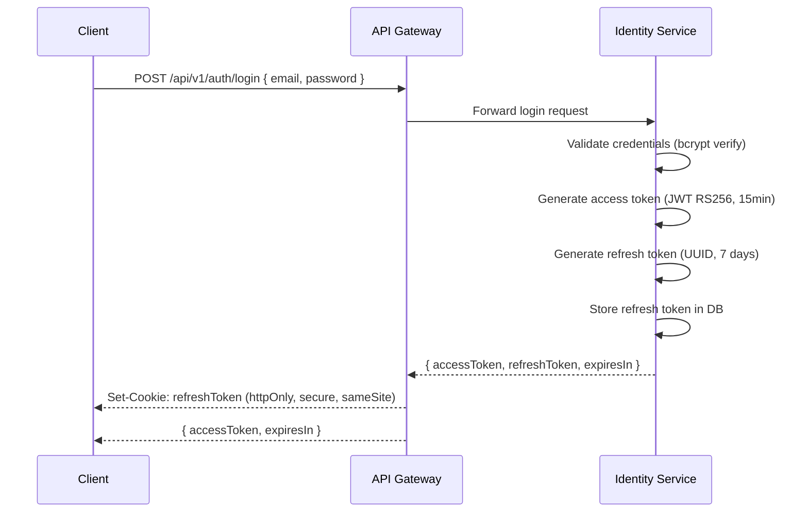
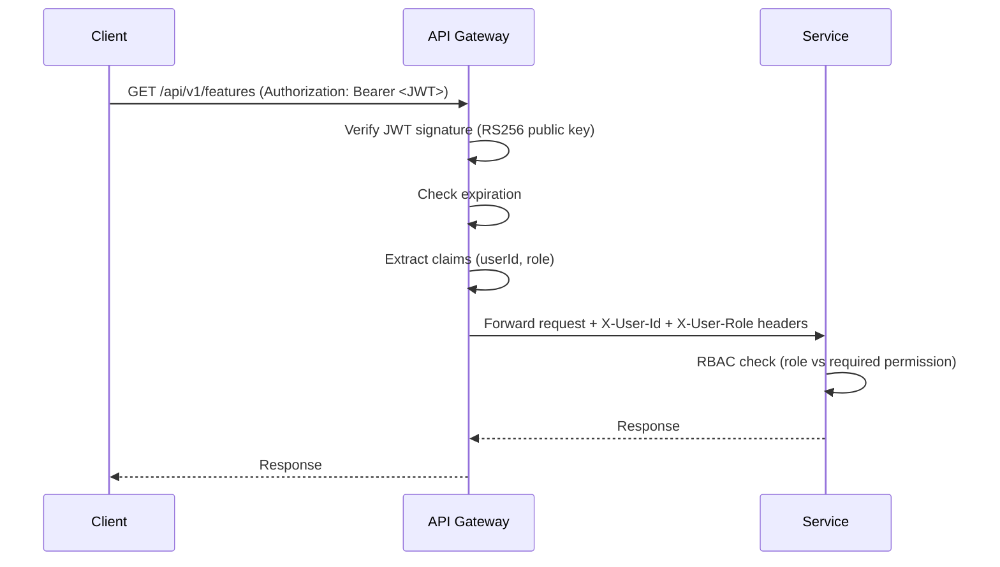
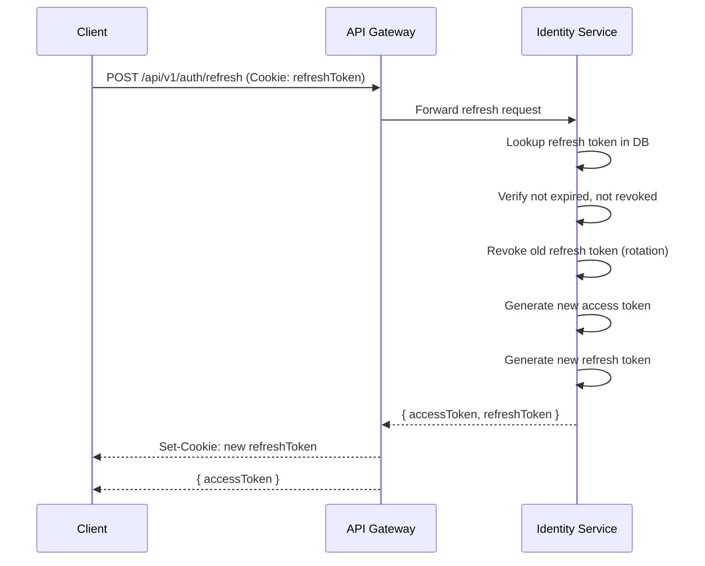
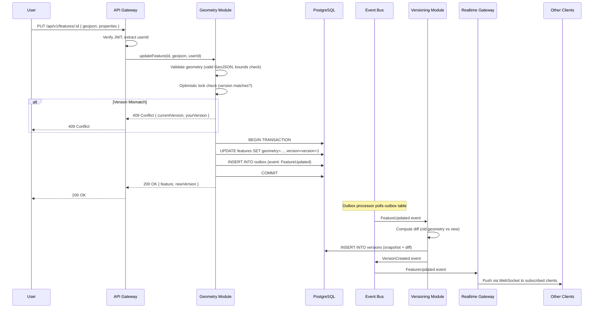
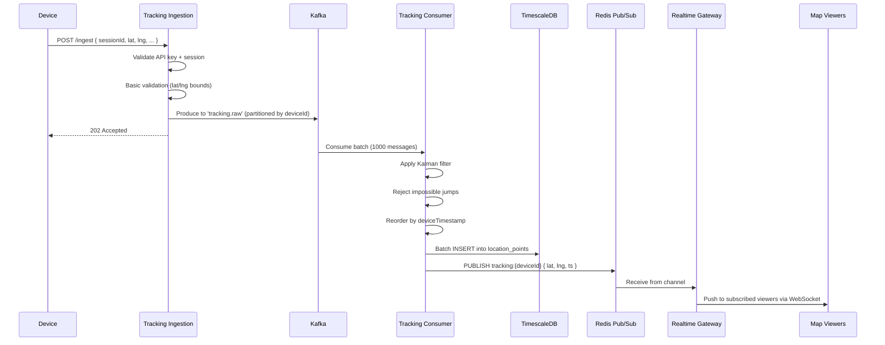

# Phase 2 — Architecture & Domain Design

> **Product**: GeoTrack — Geospatial Operations Platform  
> **Updated**: 2026-04-07  
> **Status**: Draft — Awaiting Review  
> **Input**: [Phase 1 — Business & Domain Discovery](./01-business-domain-discovery.md)

---

## 🎯 Goal

Design the system shape: service boundaries, domain model, security model, and high-level architecture. Every line of code will conform to these decisions.

---

## 1. Event Storming

### 1.1 Domain Events (Complete List)

Events are grouped by the bounded context that **emits** them.

#### Identity Context Events
```
UserRegistered          { userId, email, role, timestamp }
UserAuthenticated       { userId, method, ip, timestamp }
UserDeactivated         { userId, reason, timestamp }
RoleAssigned            { userId, role, assignedBy, timestamp }
TokenRefreshed          { userId, tokenId, timestamp }
```

#### Geometry Context Events
```
FeatureCreated          { featureId, geometryType, geojson, createdBy, timestamp }
FeatureUpdated          { featureId, previousVersionId, newGeojson, updatedBy, timestamp }
FeatureDeleted          { featureId, deletedBy, timestamp }
FeaturePropertiesChanged { featureId, changedFields, updatedBy, timestamp }
BufferComputed          { sourceFeatureId, resultGeojson, distanceMeters, timestamp }
SpatialQueryExecuted    { queryType, queryGeometry, resultCount, durationMs, timestamp }
```

#### Versioning Context Events
```
VersionCreated          { versionId, featureId, versionNumber, changeType, authorId, timestamp }
FeatureReverted         { featureId, fromVersion, toVersion, revertedBy, timestamp }
ChangesetCommitted      { changesetId, featureIds[], authorId, message, timestamp }
```

#### Tracking Context Events
```
SessionStarted          { sessionId, deviceId, startedBy, config, timestamp }
SessionEnded            { sessionId, deviceId, endedBy, reason, timestamp }
LocationReceived        { sessionId, deviceId, lat, lng, altitude, speed, bearing, accuracy, deviceTimestamp }
LocationBatchReceived   { sessionId, deviceId, points[], timestamp }
TrackSegmentCompleted   { sessionId, segmentId, pointCount, startTime, endTime }
DeviceOfflineDetected   { sessionId, deviceId, lastSeenAt, timestamp }
DeviceReconnected       { sessionId, deviceId, bufferedPointCount, timestamp }
```

### 1.2 Event-to-Context Mapping

```
Events                              Bounded Context
═══════════════════════════        ═══════════════════
UserRegistered              ─┐
UserAuthenticated            ├───→  Identity Context
RoleAssigned                 │
TokenRefreshed              ─┘

FeatureCreated              ─┐
FeatureUpdated               ├───→  Geometry Context
FeatureDeleted               │
BufferComputed               │
SpatialQueryExecuted        ─┘

VersionCreated              ─┐
FeatureReverted              ├───→  Versioning Context
ChangesetCommitted          ─┘

SessionStarted              ─┐
LocationReceived             ├───→  Tracking Context
SessionEnded                 │
TrackSegmentCompleted       ─┘
```

---

## 2. Bounded Contexts

### 2.1 Context Map (High-Level)

```
┌─────────────────────────────────────────────────────────────────────┐
│                         GeoTrack Platform                           │
│                                                                     │
│  ┌──────────────┐    ┌──────────────┐    ┌──────────────────────┐  │
│  │   Identity    │    │   Geometry    │    │     Tracking         │  │
│  │   Context     │    │   Context     │    │     Context          │  │
│  │              │    │              │    │                      │  │
│  │  Users       │    │  Features    │    │  Sessions            │  │
│  │  Roles       │    │  Geometries  │    │  Tracks              │  │
│  │  Auth        │    │  Spatial Ops │    │  LocationPoints      │  │
│  └──────┬───────┘    └──────┬───────┘    └──────────┬───────────┘  │
│         │                   │                       │              │
│         │          events   │            events     │              │
│         │         ┌─────────▼──────────┐            │              │
│         │         │   Versioning       │            │              │
│         │         │   Context          │            │              │
│         │         │                    │            │              │
│         │         │   Versions         │            │              │
│         │         │   Changesets       │            │              │
│         │         │   Diffs            │            │              │
│         │         └────────────────────┘            │              │
│         │                                           │              │
│         └───────────────┬───────────────────────────┘              │
│                         │                                          │
│              ┌──────────▼───────────┐                              │
│              │   Realtime Gateway    │  (infrastructure, not BC)   │
│              │   WebSocket + PubSub  │                              │
│              └──────────────────────┘                              │
└─────────────────────────────────────────────────────────────────────┘
```

### 2.2 Context Relationships

| Upstream Context | Downstream Context | Relationship | Pattern |
|------------------|--------------------|-------------|---------|
| Identity | Geometry | Auth dependency | Conformist (accepts Identity's JWT claims) |
| Identity | Tracking | Auth dependency | Conformist |
| Identity | Versioning | Auth dependency | Conformist |
| Geometry | Versioning | Event-driven | Published Language (FeatureCreated/Updated/Deleted events) |
| Geometry | Realtime Gateway | Event-driven | Published Language (geometry change broadcasts) |
| Tracking | Realtime Gateway | Event-driven | Published Language (location update broadcasts) |
| Versioning | Geometry | Sync query | Open Host Service (version retrieval API) |

---

### 2.3 Per-Context Domain Model

---

#### 2.3.1 Identity Context

**Responsibility**: User management, authentication, authorization

```
┌─────────────────────────────────────────┐
│           Identity Context              │
│                                         │
│  ┌─────────────────────┐               │
│  │    User (AR)         │               │
│  │    ─────────────     │               │
│  │    id: UUID          │               │
│  │    email: string     │               │
│  │    passwordHash: str │               │
│  │    role: Role (VO)   │               │
│  │    status: enum      │               │
│  │    createdAt: ts     │               │
│  │    lastLoginAt: ts   │               │
│  └─────────┬───────────┘               │
│             │ issues                    │
│  ┌─────────▼───────────┐               │
│  │  RefreshToken (E)    │               │
│  │  ──────────────      │               │
│  │  tokenId: UUID       │               │
│  │  userId: UUID        │               │
│  │  expiresAt: ts       │               │
│  │  isRevoked: bool     │               │
│  └─────────────────────┘               │
│                                         │
│  Value Objects:                         │
│  ┌────────────┐  ┌──────────────────┐  │
│  │ Role       │  │ Credentials      │  │
│  │ ─────      │  │ ───────────      │  │
│  │ viewer     │  │ email: string    │  │
│  │ editor     │  │ password: string │  │
│  │ admin      │  └──────────────────┘  │
│  └────────────┘                         │
│                                         │
│  AR = Aggregate Root                    │
│  E = Entity   VO = Value Object         │
└─────────────────────────────────────────┘
```

**Invariants**:
- Email must be unique across the system
- Password must meet complexity requirements (≥ 12 chars, mixed case, digits)
- Refresh tokens are revoked on password change
- Admin role can only be assigned by another admin

---

#### 2.3.2 Geometry Context

**Responsibility**: Feature CRUD, spatial operations, geometry validation

```
┌────────────────────────────────────────────────────────────┐
│                    Geometry Context                         │
│                                                            │
│  ┌───────────────────────────┐                             │
│  │      Feature (AR)          │                             │
│  │      ─────────────         │                             │
│  │      id: UUID              │                             │
│  │      name: string          │                             │
│  │      description: string   │                             │
│  │      geometryType: enum    │─── Point | LineString       │
│  │      geometry: GeoJSON(VO) │    | Polygon                │
│  │      properties: JSONB     │                             │
│  │      tags: string[]        │                             │
│  │      currentVersion: int   │                             │
│  │      createdBy: UUID       │                             │
│  │      updatedBy: UUID       │                             │
│  │      createdAt: timestamp  │                             │
│  │      updatedAt: timestamp  │                             │
│  │      isDeleted: bool       │  (soft delete)              │
│  └───────────────────────────┘                             │
│                                                            │
│  Value Objects:                                            │
│  ┌──────────────────────┐  ┌─────────────────────────┐    │
│  │  GeoJSON             │  │  BoundingBox             │    │
│  │  ────────             │  │  ───────────             │    │
│  │  type: string        │  │  minLat: float           │    │
│  │  coordinates: float[]│  │  minLng: float           │    │
│  │  crs: EPSG:4326      │  │  maxLat: float           │    │
│  └──────────────────────┘  │  maxLng: float           │    │
│                             └─────────────────────────┘    │
│  ┌──────────────────────┐  ┌─────────────────────────┐    │
│  │  Coordinates         │  │  SpatialQuery            │    │
│  │  ───────────         │  │  ────────────             │    │
│  │  lat: float [-90,90] │  │  queryType: enum         │    │
│  │  lng: float[-180,180]│  │  queryGeometry: GeoJSON  │    │
│  │  altitude?: float    │  │  params: { distance?,    │    │
│  └──────────────────────┘  │    buffer?, srid? }      │    │
│                             └─────────────────────────┘    │
│                                                            │
│  Domain Services:                                          │
│  ┌──────────────────────────────────────────┐              │
│  │  SpatialOperationService                  │              │
│  │  ─────────────────────────                │              │
│  │  buffer(feature, distanceM) → GeoJSON    │              │
│  │  intersect(geomA, geomB) → GeoJSON[]     │              │
│  │  contains(polygon, point) → boolean      │              │
│  │  distance(geomA, geomB) → meters         │              │
│  │  withinRadius(center, radiusM) → Feature[]│             │
│  │  withinBBox(bbox) → Feature[]             │              │
│  └──────────────────────────────────────────┘              │
└────────────────────────────────────────────────────────────┘
```

**Invariants**:
- Geometry must be valid GeoJSON (no self-intersecting polygons)
- Coordinates must be in WGS84 (EPSG:4326), lat ∈ [-90, 90], lng ∈ [-180, 180]
- Feature name ≤ 255 chars, non-empty
- Polygon vertex count ≤ 100,000 (with warning at 10,000)
- currentVersion is monotonically increasing, never decremented
- Soft-deleted features are excluded from spatial queries but preserved for history

---

#### 2.3.3 Versioning Context

**Responsibility**: Full history tracking, version snapshots, diffs, reverts

```
┌────────────────────────────────────────────────────────────────┐
│                    Versioning Context                           │
│                                                                │
│  ┌──────────────────────────────┐                              │
│  │   VersionedFeature (AR)      │                              │
│  │   ──────────────────          │                              │
│  │   featureId: UUID             │ ← references Geometry.Feature│
│  │   currentVersionNumber: int   │                              │
│  │   totalVersionCount: int      │                              │
│  │   createdAt: timestamp        │                              │
│  └──────────────┬───────────────┘                              │
│                 │ contains 1..*                                 │
│  ┌──────────────▼───────────────┐                              │
│  │       Version (E)             │                              │
│  │       ───────────             │                              │
│  │       id: UUID                │                              │
│  │       featureId: UUID         │                              │
│  │       versionNumber: int      │                              │
│  │       changeType: enum        │ ← created | updated |       │
│  │       snapshot: GeoJSON (VO)  │   deleted | reverted         │
│  │       diff: GeometryDiff (VO) │                              │
│  │       properties: JSONB       │ ← full properties snapshot   │
│  │       authorId: UUID          │                              │
│  │       message: string?        │ ← optional commit message    │
│  │       parentVersionId: UUID?  │                              │
│  │       createdAt: timestamp    │                              │
│  └──────────────────────────────┘                              │
│                                                                │
│  Value Objects:                                                │
│  ┌──────────────────────────────────────────┐                  │
│  │  GeometryDiff                             │                  │
│  │  ──────────────                           │                  │
│  │  addedVertices: Coordinates[]             │                  │
│  │  removedVertices: Coordinates[]           │                  │
│  │  movedVertices: { from, to }[]            │                  │
│  │  propertiesChanged: { field, old, new }[] │                  │
│  │  geometryTypeChanged: bool                │                  │
│  │  areaDelta: float? (m²)                   │                  │
│  │  perimeterDelta: float? (m)               │                  │
│  └──────────────────────────────────────────┘                  │
│                                                                │
│  ┌──────────────────────────────────────────┐                  │
│  │  Changeset (AR)                           │                  │
│  │  ──────────────                           │                  │
│  │  id: UUID                                 │                  │
│  │  versionIds: UUID[]                       │                  │
│  │  authorId: UUID                           │                  │
│  │  message: string                          │                  │
│  │  createdAt: timestamp                     │                  │
│  └──────────────────────────────────────────┘                  │
│                                                                │
│  Domain Services:                                              │
│  ┌──────────────────────────────────────────┐                  │
│  │  DiffService                              │                  │
│  │  ───────────                              │                  │
│  │  computeDiff(oldGeom, newGeom) → Diff     │                  │
│  │  applyDiff(geom, diff) → GeoJSON         │                  │
│  │  invertDiff(diff) → Diff (for revert)     │                  │
│  └──────────────────────────────────────────┘                  │
│  ┌──────────────────────────────────────────┐                  │
│  │  TimelineService                          │                  │
│  │  ───────────────                          │                  │
│  │  getTimeline(featureId) → Version[]       │                  │
│  │  getStateAt(featureId, ts) → Snapshot     │                  │
│  │  revert(featureId, toVersion) → Version   │                  │
│  └──────────────────────────────────────────┘                  │
└────────────────────────────────────────────────────────────────┘
```

**Invariants**:
- Version numbers are sequential per feature (v1, v2, v3...)
- Every version stores a full geometry snapshot (for fast reconstruction)
- Every version (except v1) stores a diff from previous version
- Revert creates a NEW version (never overwrites), changeType = "reverted"
- Versions are immutable — once created, never modified or deleted
- parentVersionId creates a chain for traversal

---

#### 2.3.4 Tracking Context

**Responsibility**: GPS ingestion, session management, noise filtering, time-series storage

```
┌────────────────────────────────────────────────────────────────┐
│                     Tracking Context                            │
│                                                                │
│  ┌───────────────────────────┐                                 │
│  │  TrackingSession (AR)      │                                 │
│  │  ─────────────────         │                                 │
│  │  id: UUID                  │                                 │
│  │  deviceId: UUID            │                                 │
│  │  ownerId: UUID             │ ← user who started session      │
│  │  status: enum              │ ← active | paused | ended       │
│  │  config: SessionConfig(VO) │                                 │
│  │  startedAt: timestamp      │                                 │
│  │  endedAt: timestamp?       │                                 │
│  │  lastLocationAt: timestamp?│                                 │
│  │  totalPoints: int          │                                 │
│  │  totalDistanceM: float     │                                 │
│  └───────────────┬───────────┘                                 │
│                  │ contains 1..*                                │
│  ┌───────────────▼───────────┐                                 │
│  │   Track (E)                │                                 │
│  │   ─────────                │                                 │
│  │   id: UUID                 │                                 │
│  │   sessionId: UUID          │                                 │
│  │   segmentIndex: int        │ ← increments on gap/pause       │
│  │   startTime: timestamp     │                                 │
│  │   endTime: timestamp       │                                 │
│  │   pointCount: int          │                                 │
│  │   distanceM: float         │                                 │
│  │   boundingBox: BBox (VO)   │                                 │
│  └───────────────┬───────────┘                                 │
│                  │ contains 1..∞                                │
│  ┌───────────────▼───────────┐                                 │
│  │  LocationPoint (VO)        │  ← Value Object (immutable)     │
│  │  ──────────────            │                                 │
│  │  sessionId: UUID           │                                 │
│  │  deviceId: UUID            │                                 │
│  │  lat: float                │                                 │
│  │  lng: float                │                                 │
│  │  altitude: float?          │                                 │
│  │  speed: float? (m/s)       │                                 │
│  │  bearing: float? (degrees) │                                 │
│  │  accuracy: float? (meters) │                                 │
│  │  deviceTimestamp: ts        │ ← from device clock             │
│  │  serverTimestamp: ts        │ ← ingestion time                │
│  │  isFiltered: bool          │ ← rejected by noise filter       │
│  └────────────────────────────┘                                │
│                                                                │
│  Value Objects:                                                │
│  ┌───────────────────────────────┐                             │
│  │  SessionConfig                 │                             │
│  │  ─────────────                 │                             │
│  │  minIntervalMs: int (1000)     │ ← min time between updates  │
│  │  maxSpeedKmh: float (200)      │ ← noise rejection threshold │
│  │  accuracyThresholdM: float(50) │ ← reject if accuracy >      │
│  │  trackingMode: enum            │ ← continuous | onMove        │
│  └───────────────────────────────┘                             │
│                                                                │
│  Domain Services:                                              │
│  ┌──────────────────────────────────────────────┐              │
│  │  LocationFilterService                        │              │
│  │  ───────────────────────                      │              │
│  │  applyKalmanFilter(raw) → filtered            │              │
│  │  rejectImpossibleJump(prev, curr) → bool      │              │
│  │  rejectLowAccuracy(point, threshold) → bool   │              │
│  │  reorderByTimestamp(batch) → LocationPoint[]   │              │
│  └──────────────────────────────────────────────┘              │
└────────────────────────────────────────────────────────────────┘
```

**Invariants**:
- A session must be in `active` status to accept location points
- Only one active session per device at a time
- Location points are immutable (write-once, never update)
- deviceTimestamp must not be more than 24 hours in the future
- Speed exceeding maxSpeedKmh triggers noise rejection
- Location accuracy exceeding threshold triggers rejection
- Batch uploads must be reordered by deviceTimestamp, not arrival order

---

### 2.4 Data Ownership Matrix

| Data Entity | Owner Context | Other Contexts | Access Pattern |
|-------------|--------------|----------------|----------------|
| User | **Identity** | All (read JWT claims) | Sync: JWT validation |
| RefreshToken | **Identity** | None | Internal only |
| Feature | **Geometry** | Versioning (read events) | Event: FeatureCreated/Updated |
| GeoJSON data | **Geometry** | Versioning (snapshot copy) | Event payload |
| Spatial indexes | **Geometry** | None | Internal only |
| Version | **Versioning** | Geometry (read API) | Sync: GET /versions |
| Changeset | **Versioning** | None | Sync: GET /changesets |
| GeometryDiff | **Versioning** | None | Sync: GET /versions/:id/diff |
| TrackingSession | **Tracking** | Identity (ownership) | Sync: validate owner |
| Track | **Tracking** | None | Sync: GET /tracks |
| LocationPoint | **Tracking** | Realtime Gateway (push) | Event: LocationReceived |

**Rule**: Each entity has exactly ONE owner. No shared databases. Cross-context data access is via API call or event subscription.

---

### 2.5 Communication Matrix

| From → To | Pattern | Protocol | Why |
|-----------|---------|----------|-----|
| Client → API Gateway | Sync | HTTPS REST | Standard API access |
| Client → Realtime Gateway | Async | WebSocket (Socket.IO) | Real-time bidirectional |
| API Gateway → Identity | Sync | Internal HTTP | Auth validation on every request |
| API Gateway → Geometry | Sync | Internal HTTP | CRUD requires immediate response |
| API Gateway → Tracking | Sync | Internal HTTP | Session management |
| API Gateway → Versioning | Sync | Internal HTTP | Version queries |
| Geometry → Versioning | **Async** | Message Queue | Version creation doesn't block save |
| Geometry → Realtime | **Async** | Redis Pub/Sub | Broadcast geometry changes |
| Tracking (ingestion) → Queue | **Async** | Kafka | High-throughput decoupling |
| Queue → Tracking (processor) | **Async** | Kafka Consumer | Batched processing |
| Tracking → Realtime | **Async** | Redis Pub/Sub | Broadcast location updates |
| Tracking → TimescaleDB | **Async** | Batch insert | Write-behind for throughput |

```
Communication Flow Diagram:

CLIENT                 SYNC                       ASYNC
──────    ─────────────────────────    ─────────────────────────
          ┌─────────┐                   ┌──────────┐
  REST ──▶│   API   │──sync──▶ Identity │          │
          │ Gateway │──sync──▶ Geometry ──event──▶│  Message  │──▶ Versioning
  WS ────▶│         │──sync──▶ Tracking │  Queue   │
          │         │──sync──▶ Version  │          │
          └─────────┘                   └──────────┘
                                              │
          ┌─────────┐                         │
  WS ◀────│Realtime │◀──Redis Pub/Sub─────────┘
          │ Gateway │
          └─────────┘
```

---

## 3. Security Architecture

### 3.1 Authentication Model

| Component | Choice | Details |
|-----------|--------|---------|
| Algorithm | RS256 (RSA + SHA-256) | Asymmetric — API Gateway verifies with public key, Identity signs with private key |
| Access Token | JWT, 15-minute lifetime | Contains: userId, email, role, iat, exp |
| Refresh Token | Opaque UUID, 7-day lifetime | Stored in database, revocable |
| Token Storage (client) | httpOnly secure cookie (web), secure storage (mobile) | No localStorage — XSS risk |
| Session Strategy | Stateless (JWT) | No server-side session store needed |

### 3.2 Authentication Flows

#### Login Flow



#### Protected Request Flow



#### Token Refresh Flow



### 3.3 RBAC Matrix

| Resource | Action | Viewer | Editor | Admin |
|----------|--------|:------:|:------:|:-----:|
| **Features** | List / Read | ✅ | ✅ | ✅ |
| **Features** | Create | ❌ | ✅ | ✅ |
| **Features** | Update | ❌ | ✅ (own or assigned) | ✅ |
| **Features** | Delete | ❌ | ❌ | ✅ |
| **Versions** | List / Read | ✅ | ✅ | ✅ |
| **Versions** | Revert | ❌ | ✅ (own features) | ✅ |
| **Spatial Queries** | Execute | ✅ | ✅ | ✅ |
| **Tracking Sessions** | List / Read (own) | ✅ | ✅ | ✅ |
| **Tracking Sessions** | List / Read (all) | ❌ | ❌ | ✅ |
| **Tracking Sessions** | Create | ❌ | ✅ | ✅ |
| **Tracking Sessions** | End / Manage | ❌ | ✅ (own) | ✅ |
| **Tracking Data** | Read (own) | ✅ | ✅ | ✅ |
| **Tracking Data** | Read (all) | ❌ | ❌ | ✅ |
| **Tracking Data** | Export | ❌ | ✅ (own) | ✅ |
| **Users** | List / Read | ❌ | ❌ | ✅ |
| **Users** | Create / Invite | ❌ | ❌ | ✅ |
| **Users** | Update Role | ❌ | ❌ | ✅ |
| **Users** | Deactivate | ❌ | ❌ | ✅ |
| **System Health** | View | ❌ | ❌ | ✅ |

### 3.4 Encryption & Data Protection

| Layer | Method | Details |
|-------|--------|---------|
| In Transit | TLS 1.3 | All HTTP and WebSocket connections |
| At Rest (DB) | AES-256 | PostgreSQL TDE or AWS RDS encryption |
| At Rest (Files) | AES-256 | S3 SSE-S3 or SSE-KMS |
| Passwords | bcrypt (cost=12) | Never stored plain, never logged |
| JWT Signing | RSA-2048 | Private key in Secrets Manager |
| Refresh Tokens | SHA-256 hash in DB | Original token never stored |

### 3.5 PII Classification

| Field | PII Level | Where Stored | Protection |
|-------|-----------|-------------|------------|
| Email | High | Identity DB | Encrypted at rest, masked in logs |
| Password Hash | Critical | Identity DB | bcrypt, never leaves Identity context |
| GPS Location | High (when linked to user) | Tracking DB | Encrypted at rest, RBAC-controlled |
| Device ID | Medium | Tracking DB | Pseudonymized for analytics |
| IP Address | Medium | Logs | Masked after 30 days |
| User Name | Low | Identity DB | Standard protection |

---

## 4. System Architecture

### 4.1 Architecture Diagram

```
┌─────────────────────────────────────────────────────────────────────────────┐
│                              CLIENTS                                        │
│   ┌──────────┐  ┌──────────┐  ┌──────────┐  ┌──────────────────────────┐  │
│   │  Web App  │  │ Mobile   │  │ IoT/GPS  │  │  Admin Dashboard         │  │
│   │ (SPA)    │  │  App     │  │ Device   │  │                          │  │
│   └────┬─────┘  └────┬─────┘  └────┬─────┘  └────────────┬─────────────┘  │
└────────┼──────────────┼──────────────┼────────────────────┼─────────────────┘
         │              │              │                    │
         ▼              ▼              ▼                    ▼
┌─────────────────────────────────────────────────────────────────────────────┐
│                          EDGE / INGRESS                                     │
│   ┌──────────────┐     ┌──────────────┐                                    │
│   │     CDN       │     │  WAF / DDoS  │                                    │
│   │  (Map Tiles)  │     │  Protection  │                                    │
│   └──────────────┘     └──────┬───────┘                                    │
│                               │                                             │
│                    ┌──────────▼──────────┐                                  │
│                    │   Load Balancer      │                                  │
│                    │   (Layer 7 / NGINX)  │                                  │
│                    └──────────┬──────────┘                                  │
└───────────────────────────────┼──────────────────────────────────────────────┘
                                │
         ┌──────────────────────┼──────────────────────┐
         │                      │                      │
         ▼                      ▼                      ▼
┌────────────────┐  ┌────────────────────┐  ┌──────────────────┐
│  API Gateway    │  │  Tracking Ingestion│  │  Realtime Gateway │
│  (REST API)     │  │  (HTTP endpoint)   │  │  (WebSocket)      │
│                 │  │                    │  │                   │
│  Routes:        │  │  POST /ingest      │  │  Socket.IO        │
│  /api/v1/*      │  │  High-throughput   │  │  Channels:        │
│                 │  │  Rate-limited      │  │  - tracking:*     │
│  Auth: JWT      │  │  Auth: API Key     │  │  - features:*     │
│  Rate Limit     │  │                    │  │  - session:*      │
│  CORS           │  │                    │  │                   │
└───────┬────────┘  └────────┬───────────┘  └────────┬──────────┘
        │                    │                       │
        │                    ▼                       │
        │         ┌──────────────────┐               │
        │         │   Kafka / Queue   │               │
        │         │                  │               │
        │         │  Topics:         │               │
        │         │  - tracking.raw  │               │
        │         │  - geometry.events│              │
        │         │  - tracking.dlq  │               │
        │         └────────┬─────────┘               │
        │                  │                         │
        ▼                  ▼                         │
┌─────────────────────────────────────────┐          │
│             APPLICATION SERVICES         │          │
│                                         │          │
│  ┌─────────────┐  ┌─────────────────┐  │          │
│  │  Identity    │  │  Tracking       │  │          │
│  │  Service     │  │  Service        │  │          │
│  │             │  │                 │  │          │
│  │  • Register  │  │  • Kafka Consumer│ │          │
│  │  • Login     │  │  • Noise Filter │  │          │
│  │  • Refresh   │  │  • Batch Insert │  │          │
│  │  • RBAC      │  │  • Session Mgmt │  │          │
│  └──────┬──────┘  └────────┬────────┘  │          │
│         │                  │           │          │
│  ┌──────┴──────┐  ┌───────┴─────────┐ │          │
│  │  Geometry    │  │  Versioning      │ │          │
│  │  Service     │  │  Service         │ │          │
│  │             │  │                  │ │          │
│  │  • CRUD      │  │  • Store version │ │          │
│  │  • Spatial   │  │  • Compute diff  │ │          │
│  │  • Validate  │  │  • Timeline      │ │          │
│  │  • Buffer    │  │  • Revert        │ │          │
│  └──────┬──────┘  └───────┬──────────┘ │          │
│         │                  │            │          │
└─────────┼──────────────────┼────────────┘          │
          │                  │                       │
          ▼                  ▼                       ▼
┌─────────────────────────────────────────────────────────────┐
│                     MESSAGING / CACHE                        │
│                                                             │
│   ┌─────────────────────────────────────────────┐           │
│   │              Redis                           │           │
│   │                                             │           │
│   │   • Pub/Sub channels (realtime fanout)      │           │
│   │   • Session cache (JWT claims)              │           │
│   │   • Rate limiter (sliding window)           │           │
│   │   • Tile cache (overflow from CDN)          │           │
│   └─────────────────────────────────────────────┘           │
└─────────────────────────────────────────────────────────────┘
          │                  │
          ▼                  ▼
┌─────────────────────────────────────────────────────────────┐
│                       DATA STORES                            │
│                                                             │
│   ┌──────────────────┐   ┌───────────────────────────────┐ │
│   │  PostgreSQL       │   │  TimescaleDB                   │ │
│   │  + PostGIS        │   │  (PostgreSQL extension)        │ │
│   │                  │   │                               │ │
│   │  • features      │   │  • location_points            │ │
│   │  • versions      │   │    (hypertable, partitioned   │ │
│   │  • changesets    │   │     by time, daily chunks)    │ │
│   │  • users         │   │  • continuous aggregates      │ │
│   │  • sessions      │   │  • retention policies         │ │
│   │                  │   │                               │ │
│   │  Indexes:        │   │  Indexes:                     │ │
│   │  • GiST (spatial)│   │  • btree (session, device)    │ │
│   │  • btree (FK)    │   │  • time partitioning          │ │
│   │  • GIN (JSONB)   │   │                               │ │
│   └──────────────────┘   └───────────────────────────────┘ │
│                                                             │
│   ┌──────────────────────────────────────────────────────┐ │
│   │  Tile Server (self-hosted or Mapbox/MapTiler)         │ │
│   │  • Vector tiles (MVT / PBF)                          │ │
│   │  • Served via CDN                                     │ │
│   └──────────────────────────────────────────────────────┘ │
└─────────────────────────────────────────────────────────────┘
```

### 4.2 Service Catalog

| Service | Responsibility | Database | Scaling Strategy | Resilience |
|---------|---------------|----------|-----------------|------------|
| **API Gateway** | Routing, auth validation, rate limiting, CORS | None (stateless) | Horizontal (multiple instances) | Circuit breaker to downstream services |
| **Identity Service** | User CRUD, authentication, JWT signing, RBAC | PostgreSQL (users, tokens) | Horizontal (stateless after JWT) | Retry with backoff on DB |
| **Geometry Service** | Feature CRUD, spatial operations, validation | PostgreSQL + PostGIS (features) | Horizontal (read replicas for queries) | Circuit breaker, timeout on spatial ops |
| **Versioning Service** | Version storage, diff computation, timeline, revert | PostgreSQL (versions, changesets) | Horizontal (event consumer scaling) | Idempotent event processing, DLQ |
| **Tracking Service** | GPS ingestion, noise filtering, session management | TimescaleDB (location_points) | Horizontal (Kafka consumer groups) | Back-pressure, rate limiting, DLQ |
| **Realtime Gateway** | WebSocket management, channel subscriptions, push | Redis (pub/sub) | Horizontal (sticky sessions + Redis adapter) | Reconnection with backoff |
| **Tracking Ingestion** | HTTP endpoint for device location submission | None (writes to Kafka) | Horizontal (stateless) | Rate limiting per device |

### 4.3 Resilience Patterns

| Interaction | Pattern | Config |
|-------------|---------|--------|
| Gateway → Identity | Circuit Breaker | Open: 5 failures in 30s, Half-open: 10s |
| Gateway → Geometry | Circuit Breaker + Timeout | Timeout: 5s, Open: 5 failures in 30s |
| Gateway → Tracking | Circuit Breaker + Timeout | Timeout: 3s, Open: 5 failures in 30s |
| Geometry → Queue | Retry + DLQ | 3 retries, exponential backoff (1s, 2s, 4s), then DLQ |
| Queue → Versioning | Idempotent Consumer + DLQ | Dedup by eventId, 3 retries, then DLQ |
| Queue → Tracking DB | Batch Insert + Retry | Batch of 1000, retry 3x, then DLQ |
| Client → WebSocket | Auto-reconnect | Exponential backoff (1s → 30s max), jitter |
| Spatial Query | Timeout | 10s for standard, 30s for complex with warning |

---

## 5. Deployment Architecture — Starting Point

### 5.1 Pragmatic Starting Architecture

> [!IMPORTANT]  
> **Start as a modular monolith. Extract services when scaling demands it.**  
> For a solo developer or small team, full microservices from day 1 = distributed monolith with 10x operational complexity. The domain model and boundaries are designed for eventual extraction.

```
Phase 1 (MVP):   Modular Monolith + Separate Tracking Ingestion
━━━━━━━━━━━━━━━━━━━━━━━━━━━━━━━━━━━━━━━━━━━━━━━━━━━━━━━━━━━━

┌───────────────────────────────────────────────┐
│         GeoTrack Monolith                     │
│                                               │
│  ┌──────────┐ ┌──────────┐ ┌──────────────┐ │
│  │ Identity  │ │ Geometry │ │  Versioning  │ │
│  │ Module    │ │ Module   │ │  Module      │ │
│  └──────────┘ └──────────┘ └──────────────┘ │
│                                               │
│  Shared PostgreSQL + PostGIS                  │
│  (but separate schemas per module!)           │
└───────────────────────┬───────────────────────┘
                        │
         ┌──────────────┼──────────────┐
         │              │              │
┌────────▼───────┐  ┌───▼──────┐  ┌───▼──────┐
│ Tracking       │  │  Redis   │  │  Kafka   │
│ Ingestion      │  │          │  │          │
│ (separate svc) │  │ PubSub   │  │ tracking │
│                │  │ Cache    │  │ .raw     │
└────────────────┘  └──────────┘  └──────────┘

Phase 2 (Scale):  Extract when needed
━━━━━━━━━━━━━━━━━━━━━━━━━━━━━━━━━━━━
• Extract Tracking Service (different scaling: 50K write/sec)
• Extract Realtime Gateway (WebSocket scaling)
• Keep Geometry + Versioning together (tight coupling)
• Keep Identity in monolith unless shared with other products

Phase 3 (Growth): Full microservices (only if justified)
━━━━━━━━━━━━━━━━━━━━━━━━━━━━━━━━━━━━━━━━━━━━━━━━━━━━━━━
• Separate databases per service
• Full event-driven communication
• Independent deployment pipelines
```

### 5.2 Extraction Triggers

| Trigger | What to Extract | Why |
|---------|----------------|-----|
| Tracking ingestion > 10K/sec | Tracking Service + TimescaleDB | Different scaling requirements |
| WebSocket connections > 5K | Realtime Gateway | Memory-bound, needs dedicated instances |
| Team > 3 developers | Service per team | Conway's Law |
| Geometry queries latency > 2s | Query replica / Read service | Separate read/write scaling |
| Identity shared with other products | Identity Service | Reuse across products |

---

## 6. Architecture Decision Records (ADRs)

### ADR-001: Versioning Strategy — Snapshot + Diff Hybrid

**Status**: Accepted

**Context**:  
Geometries need full version history with the ability to view any past state, compute diffs between versions, and revert to previous versions. Two approaches were considered:

1. **Pure Event Sourcing**: Store only events (FeatureCreated, VertexMoved, VertexAdded...), reconstruct state by replaying events
2. **Snapshot-Based**: Store full geometry per version
3. **Hybrid**: Store full snapshot + computed diff per version

**Decision**:  
**Hybrid approach — full snapshot per version + computed diff from previous version.**

**Rationale**:

| Criterion | Event Sourcing | Snapshot-Only | Hybrid (chosen) |
|-----------|:-------------:|:-------------:|:----------------:|
| View any past state | Slow (replay all events) | ✅ Fast (direct read) | ✅ Fast (direct read) |
| Compute diff | ✅ Built-in (events ARE diffs) | Slow (compute on read) | ✅ Fast (pre-computed) |
| Storage cost | Low (events only) | High (full copy every version) | Medium-High (snapshot + diff) |
| Complexity | Very High (event schema design, projections, snapshotting) | Low | Medium |
| Revert | Complex (compensating events) | ✅ Simple (copy snapshot to new version) | ✅ Simple (copy snapshot) |
| GeoJSON compatibility | Poor (custom event → GeoJSON projection) | ✅ Native | ✅ Native |
| Timeline playback | Complex (replay + project for each frame) | ✅ Direct read | ✅ Direct read |
| Reconstruction after schema change | Very Hard | N/A | N/A |

**Key Insight**: GeoJSON geometries are not well-suited for event sourcing. A single vertex drag generates dozens of events. The cost of replaying hundreds of fine-grained geometry events to reconstruct a state far exceeds storing a few extra KB per snapshot.

**Consequences**:
- ✅ Fast O(1) read for any version — critical for timeline playback
- ✅ Pre-computed diffs for fast comparison UI
- ✅ Simple revert: copy snapshot → new version with changeType="reverted"
- ✅ Standard GeoJSON storage — compatible with all GIS tools
- ⚠️ Higher storage cost (~10-50KB per version vs ~1-5KB for events)
- ⚠️ Must compute diff at write time (acceptable — writes are infrequent vs reads)
- 📊 At 5K edits/day × 30KB avg = 150MB/day = 50GB/year — well within budget

---

### ADR-002: Tracking Data Storage — TimescaleDB

**Status**: Accepted

**Context**:  
Tracking data is time-series: ordered by time, append-only, queried by time range. At 10K device updates/sec, we need efficient time-range queries, automatic partitioning, and data lifecycle management.

**Candidates**:

| Option | Pros | Cons |
|--------|------|------|
| PostgreSQL (plain) | Familiar, PostGIS | No auto-partitioning, manual retention |
| TimescaleDB | PostgreSQL-compatible, auto-chunking, compression, retention policies, continuous aggregates | Additional extension |
| InfluxDB | Purpose-built time-series | No SQL, no PostGIS, separate system |
| Cassandra | Massive write throughput | Operational complexity, no spatial queries |

**Decision**: **TimescaleDB** (PostgreSQL extension)

**Rationale**:
- Same PostgreSQL instance = one less database to manage
- Hypertables auto-partition by time (daily chunks)
- 10-20x compression on time-series data
- Continuous aggregates for real-time analytics (5-min, 1-hr rollups)
- Retention policies: drop raw data > 90 days, keep aggregates for 3 years
- Still supports PostGIS spatial functions on location data
- SQL-compatible — no new query language

**Consequences**:
- ✅ Automatic time-based partitioning (no manual partition management)
- ✅ Compression: 500GB/year → ~50GB/year with columnar compression
- ✅ Same SQL interface — team already knows PostgreSQL
- ⚠️ Must run TimescaleDB extension (Apache 2.0 license)
- ⚠️ Some TimescaleDB features (multi-node) require paid license — single-node sufficient for v1

---

### ADR-003: Starting Architecture — Modular Monolith with Separate Tracking Ingestion

**Status**: Accepted

**Context**:  
The domain model defines 4 bounded contexts. Pure microservices would create 4-6 separate services each with its own database, deployment pipeline, and operational overhead. For a solo developer or small team, this is premature.

**Decision**: **Modular Monolith** with these exceptions:
1. **Tracking Ingestion**: Separate process (different scaling profile — 50K writes/sec vs 10 reads/sec)
2. **Realtime Gateway**: Separate process (WebSocket connections are long-lived, different resource profile)

**Rationale**:
- Solo developer cannot operate 6 services + databases + message brokers effectively
- Modular monolith with separate schemas per module = same domain boundaries
- Internal module communication via function calls (not HTTP) = 100x faster, no network failure modes
- Extraction to microservices is a deployment decision, not a code rewrite (if boundaries are clean)
- The two exceptions (Tracking Ingestion, Realtime Gateway) have fundamentally different runtime characteristics

**Module Boundary Rules**:
1. Each module has its own database schema (no cross-schema queries)
2. Modules communicate via defined interfaces (service classes), never direct repository access
3. Cross-module events go through an internal event bus (in-process, same DB transaction)
4. Each module can be extracted to a separate service by replacing function calls with HTTP/gRPC

**Consequences**:
- ✅ 3 deployable units instead of 6-8 (monolith + tracking ingestion + realtime)
- ✅ One PostgreSQL instance with multiple schemas
- ✅ Shared connection pool, shared auth middleware
- ✅ Simple local development (one `docker-compose up`)
- ⚠️ Must enforce module boundaries through code discipline (no shortcuts across schemas)
- ⚠️ Shared deployment — one module failure can affect others (mitigated by health checks)

---

### ADR-004: Spatial Operations — PostGIS Server-Side

**Status**: Accepted

**Context**:  
Spatial operations (buffer, intersect, contains, distance) can be performed either:
1. In the database (PostGIS functions)
2. In the application (Turf.js or JTS)
3. In the client (Turf.js in browser)

**Decision**: **PostGIS for all authoritative spatial operations. Turf.js in the client for display-only operations (preview buffer, snapping, etc.).**

**Rationale**:

| Operation | PostGIS | Application (Turf.js server) | Client (Turf.js browser) |
|-----------|:-------:|:---------------------------:|:------------------------:|
| Buffer | ✅ ST_Buffer — handles projection correctly | ⚠️ Turf approximates on sphere | ⚠️ Browser payload |
| Intersect | ✅ ST_Intersects + GiST index = O(log n) | ❌ Loads all geometries to memory | ❌ Impossible at scale |
| Contains | ✅ ST_Contains + GiST index = O(log n) | ❌ Same | ❌ Same |
| Distance | ✅ ST_Distance / ST_DWithin — uses index | ❌ Same | ❌ Same |
| BBox query | ✅ && operator + GiST = fastest | ❌ | ❌ |

**Key Insight**: PostGIS spatial indexes (GiST) turn O(n) spatial operations into O(log n). For a database with 100K features, this is the difference between 50ms and 5000ms.

**Consequences**:
- ✅ Spatial operations are indexed — fast at scale
- ✅ Correct geodetic calculations (PostGIS handles projections properly)
- ✅ Single source of truth for spatial logic
- ⚠️ Tight coupling to PostgreSQL — acceptable trade-off for a spatial system
- 📝 Client uses Turf.js for preview-only operations (buffer preview ring while drawing)

---

### ADR-005: Real-Time Communication — Socket.IO with Redis Adapter

**Status**: Accepted

**Context**:  
Real-time requirements:
- Push location updates to map viewers (~10K updates/sec)
- Broadcast geometry changes to connected editors
- Support 10K+ concurrent WebSocket connections across multiple server instances

**Candidates**:

| Option | Pros | Cons |
|--------|------|------|
| Raw WebSocket | Lightweight, standard | No rooms, no reconnect, no fallback |
| Socket.IO | Rooms/namespaces, auto-reconnect, HTTP fallback, Redis adapter | Heavier, Socket.IO-specific protocol |
| SSE (Server-Sent Events) | Simple, HTTP-based | Unidirectional only, no binary |
| MQTT | IoT-standard, lightweight | Separate broker, different protocol |

**Decision**: **Socket.IO with Redis Adapter**

**Rationale**:
- **Rooms**: Natural fit for spatial subscriptions (subscribe to area/device/feature)
- **Redis Adapter**: Enables multi-instance fan-out without custom pub/sub code
- **Auto-reconnect**: Critical for mobile clients with flaky connections
- **Namespace isolation**: `/tracking` for location updates, `/features` for geometry changes
- **HTTP polling fallback**: Works behind restrictive corporate firewalls

**Channel Design**:
```
Namespace: /tracking
  Room: device:{deviceId}       → subscribe to single device
  Room: session:{sessionId}     → subscribe to all devices in session
  Room: bbox:{z}:{x}:{y}       → subscribe to tile region (for map viewport)

Namespace: /features
  Room: feature:{featureId}     → subscribe to single feature changes
  Room: layer:{layerId}         → subscribe to layer changes
  Room: bbox:{z}:{x}:{y}       → subscribe to features in tile region
```

**Consequences**:
- ✅ Built-in room management for spatial subscriptions
- ✅ Multi-instance scaling via Redis adapter
- ✅ Reliable reconnection with client-side event replay
- ⚠️ Socket.IO adds ~15% overhead vs raw WebSocket — acceptable for the features gained
- ⚠️ Redis becomes another infrastructure dependency — already using it for caching

---

## 7. Cross-Context Integration Flows

### 7.1 Geometry Edit → Version Creation Flow



### 7.2 Tracking Location Ingestion Flow



---

## ✅ Phase 2 Done Criteria Checklist

| Criterion | Status |
|-----------|--------|
| All bounded contexts identified with data ownership | ✅ 4 contexts + 1 infrastructure |
| Sync vs async per interaction documented | ✅ Full communication matrix |
| Auth flow has sequence diagrams | ✅ Login, protected request, refresh |
| RBAC matrix covers all roles × resources | ✅ 3 roles × 18 resource-actions |
| System diagram shows full request path | ✅ Architecture diagram |
| ≥ 3 ADRs for critical decisions | ✅ 5 ADRs documented |
| Service catalog with resilience patterns | ✅ 7 services, 8 resilience configs |

---

## Connection to Next Phase

**Phase 3: Data, API & Contract Design** will use:
- **Bounded contexts** → derive per-service database schemas (ER diagrams)
- **Entities/VOs** → derive tables, columns, types, constraints
- **Communication matrix** → determine which interactions need OpenAPI specs vs event schemas
- **Versioning ADR** → design `versions` table with snapshot + diff columns
- **Tracking ADR** → design TimescaleDB hypertable with partitioning strategy
- **RBAC matrix** → enforce at API level (middleware) and query level (row filters)

### 🛑 APPROVAL GATE → 🏗️ Architecture Review → Review this document before proceeding to Phase 3
