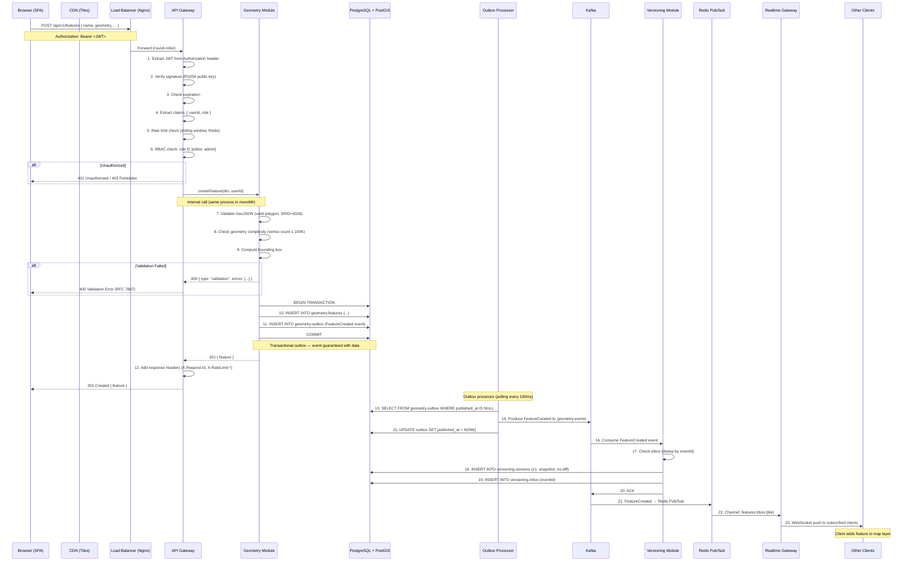
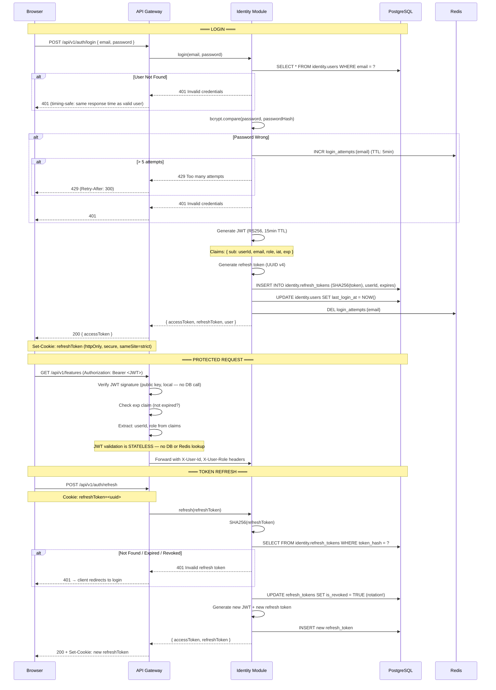
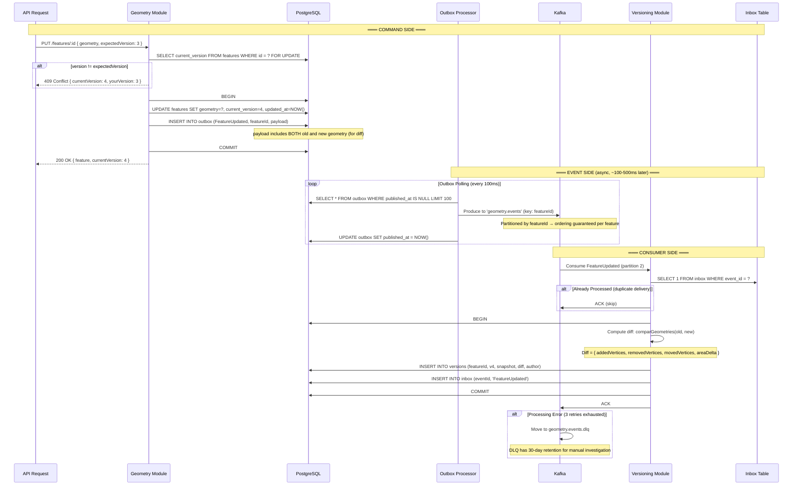
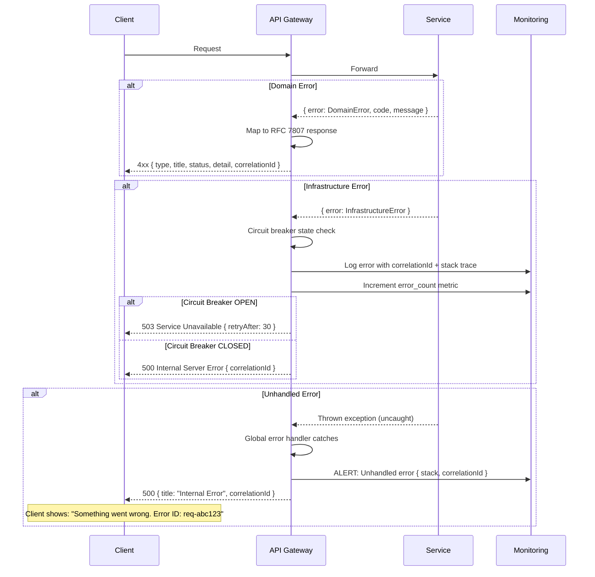
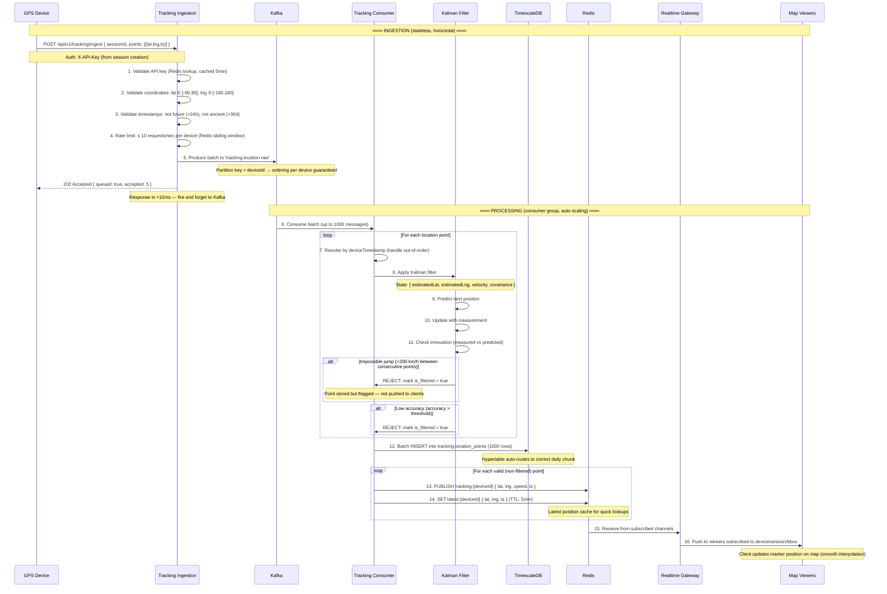
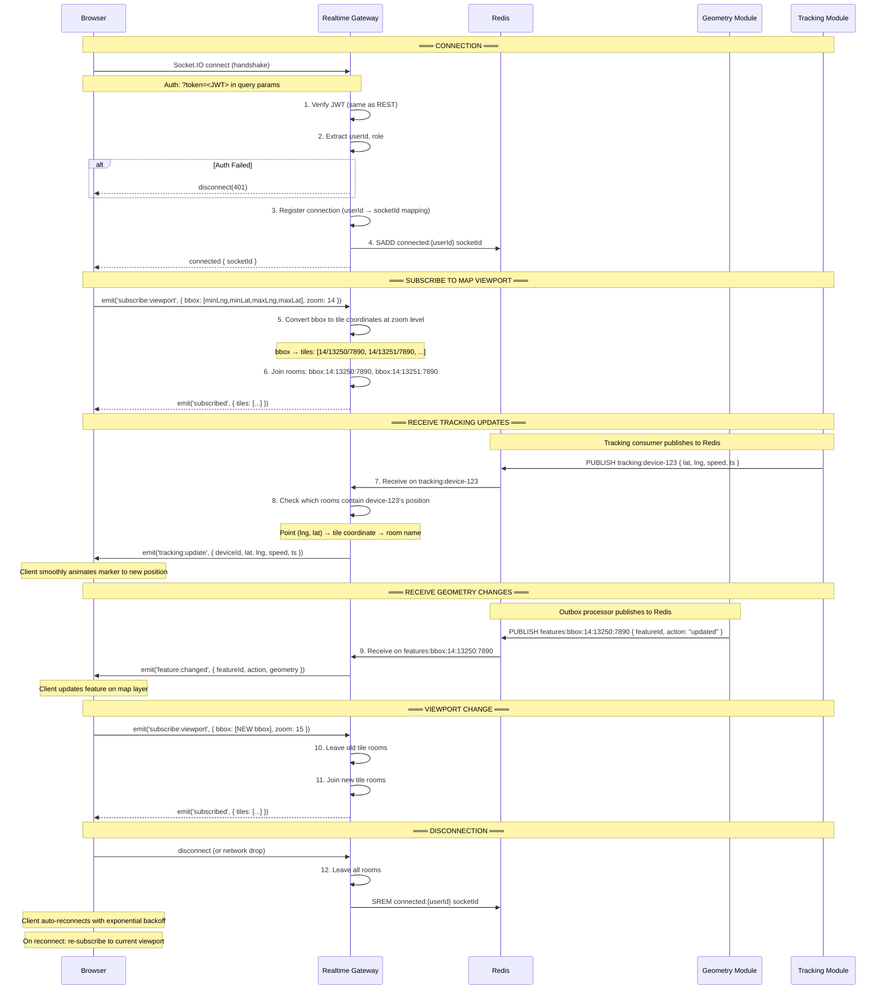
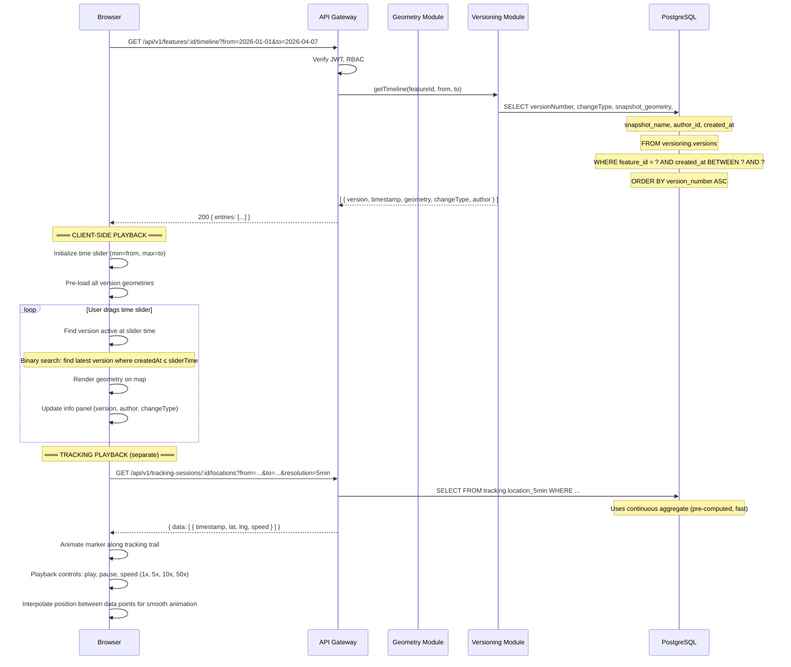
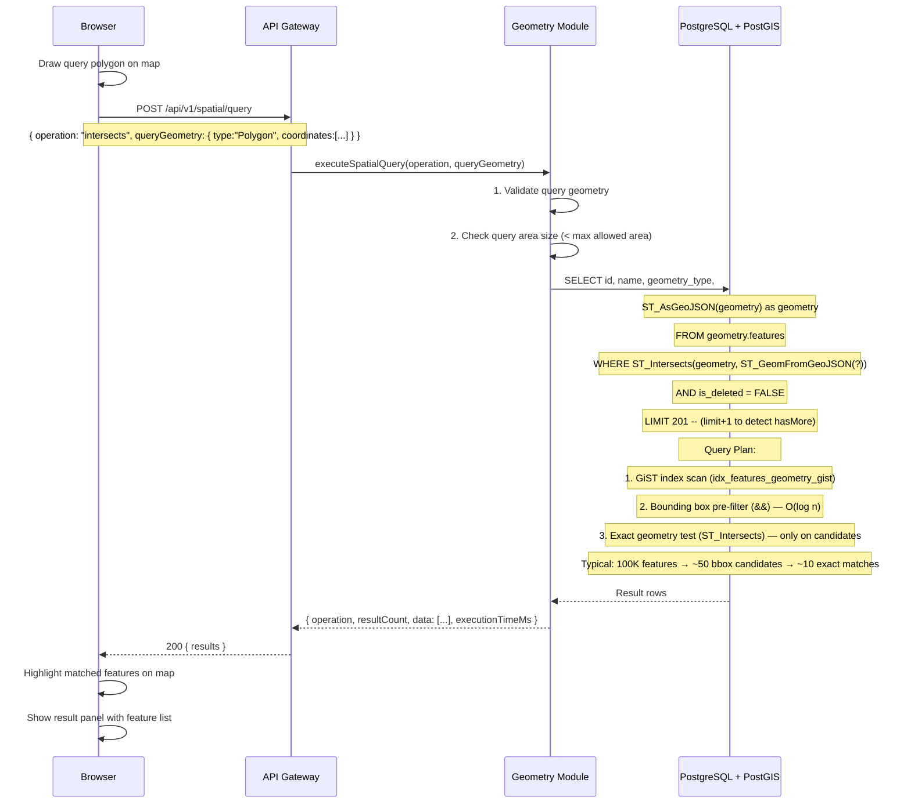

# Phase 4 — System Flows & Tech Stack

> **Product**: GeoTrack — Geospatial Operations Platform  
> **Updated**: 2026-04-07  
> **Status**: Draft — Awaiting Review  
> **Input**: [Phase 2](./02-architecture-domain-design.md) + [Phase 3](./03-data-api-contract-design.md)

---

## 🎯 Goal

Trace every request end-to-end through the system. Select the exact technology for each component. Design the infrastructure shape. Answer: "If I follow a single request from the browser to the database and back, what happens at every step?"

---

## 1. Core System Flows

### Flow 1: HTTP Request — Feature CRUD (Create)

**Scenario**: Editor creates a new polygon feature on the map.



**Failure Points & Handling**:

| #     | Failure Point         | Impact                      | Handling                                         |
| ----- | --------------------- | --------------------------- | ------------------------------------------------ |
| 2     | JWT signature invalid | Request rejected            | 401 response, client prompts re-login            |
| 5     | Rate limit exceeded   | Request rejected            | 429 with Retry-After header                      |
| 7     | Invalid geometry      | Request rejected            | 400 with specific validation errors              |
| 10-11 | DB write fails        | Feature not created         | 500, client retries, transaction rolls back both |
| 14    | Kafka produce fails   | Event not published         | Outbox retains event, next poll retries          |
| 16    | Kafka consume fails   | Version not created         | Kafka retries delivery (at-least-once)           |
| 17    | Duplicate event       | Potential double processing | Inbox dedup prevents duplicate version           |
| 22    | Redis pub/sub fails   | Real-time push missed       | Non-critical: clients will see on next API fetch |

**Correlation ID Propagation**:

```
Browser → X-Request-Id: req-abc123
  → API Gateway logs: correlationId=req-abc123
    → Geometry Module logs: correlationId=req-abc123
      → Outbox event: correlationId=req-abc123
        → Kafka message: correlationId=req-abc123
          → Versioning Module logs: correlationId=req-abc123
            → WebSocket push: correlationId=req-abc123
```

---

### Flow 2: Authentication — Login, Protected Request, Refresh

**Scenario**: User logs in, makes API calls, token expires, auto-refreshes.



**Security Notes**:

- Login response time is constant regardless of whether user exists (timing-safe)
- Rate limiting on login: 5 attempts per email per 5 minutes
- Refresh token rotation: old token revoked on each refresh (prevents token theft replay)
- JWT validation is purely local (public key verification) — no DB call per request

---

### Flow 3: Event Flow — Geometry Edit → Version Creation

**Scenario**: Complete async event lifecycle from command to eventual consistency.



**Outbox Processor Details**:

```
Polling interval:    100ms
Batch size:          100 events
Max retries:         3 (per event)
Retry backoff:       100ms, 200ms, 400ms
Failure behavior:    Skip event, mark failed, alert
Cleanup:             DELETE WHERE published_at < NOW() - 30 days
```

---

### Flow 4: Error Handling — Full Taxonomy

```
Error Taxonomy:
═══════════════

1. DOMAIN ERRORS (predictable, part of business logic)
   ├── ValidationError (400)
   │   ├── InvalidGeometry: self-intersecting, out of bounds
   │   ├── InvalidInput: missing fields, wrong types
   │   └── BusinessRule: "cannot delete feature with active references"
   ├── NotFoundError (404)
   │   └── Resource does not exist or is soft-deleted
   ├── ConflictError (409)
   │   └── Optimistic lock: version mismatch
   ├── ForbiddenError (403)
   │   └── RBAC: insufficient role for operation
   └── RateLimitError (429)
       └── Per-client or per-endpoint rate exceeded

2. INFRASTRUCTURE ERRORS (unexpected, system failures)
   ├── DatabaseError (500)
   │   ├── Connection pool exhausted → circuit breaker opens
   │   ├── Query timeout → log + alert
   │   └── Replication lag → read from primary (fallback)
   ├── KafkaError (500)
   │   ├── Producer failure → outbox retains event (no data loss)
   │   ├── Consumer failure → Kafka retries (at-least-once)
   │   └── DLQ overflow → alert on-call
   ├── RedisError (degraded)
   │   ├── Cache miss → fallback to DB (slower, not broken)
   │   ├── Pub/Sub failure → real-time push fails (non-critical)
   │   └── Rate limiter unavailable → allow request (fail-open)
   └── NetworkError (502/503)
       ├── Downstream service unreachable → circuit breaker
       └── DNS failure → retry with backoff

3. UNHANDLED ERRORS (bugs)
   └── Catch-all middleware → 500 Internal Server Error
       ├── Log full stack trace with correlationId
       ├── Return sanitized error to client (no stack trace)
       └── Alert if error rate > threshold
```

**Error Response Flow**:



---

### Flow 5: Tracking Ingestion — High-Throughput Pipeline

**Scenario**: 10K devices sending GPS locations every 1-5 seconds.



**Throughput Design**:

```
                    Capacity per Instance       Instances
Tracking Ingestion: 10K requests/sec            3 (behind LB)
Kafka Producers:    50K messages/sec             (built into ingestion)
Kafka Consumers:    20K messages/sec per         3 (consumer group)
TimescaleDB Writes: 50K inserts/sec (batch)      1 (single node v1)
Redis Pub/Sub:      200K messages/sec             1 (single node v1)
```

**Back-Pressure Strategy**:

```
IF Kafka consumer lag > 100K messages:
  → Alert: "Tracking processing falling behind"
  → Auto-scale: Add consumer instances to consumer group

IF TimescaleDB insert latency > 500ms:
  → Increase batch size (1000 → 5000)
  → If still slow: buffer in consumer memory (max 10s)
  → If still slow: alert, do NOT drop data

IF Redis pub/sub subscribers > 50K:
  → Rate-limit push: batch updates per 100ms instead of per-point
  → Reduce precision: round coordinates to 5 decimal places
```

---

### Flow 6: Real-Time Synchronization — WebSocket Lifecycle

**Scenario**: User opens map → subscribes to area → receives live updates.



**WebSocket Scaling Architecture**:

```
          Browser 1 ──┐
          Browser 2 ──┼──→ RT Instance 1 ──┐
          Browser 3 ──┘                    │
                                           ├──→ Redis Pub/Sub ←── Tracking Consumer
          Browser 4 ──┐                    │                  ←── Outbox Processor
          Browser 5 ──┼──→ RT Instance 2 ──┘
          Browser 6 ──┘

• Sticky sessions (WebSocket): LB routes by connection ID
• Redis adapter: events published once, delivered to all instances
• Room membership is per-instance (no shared state needed)
```

---

### Flow 7: History Playback — Timeline Reconstruction

**Scenario**: Analyst uses time slider to replay geometry changes.



---

### Flow 8: Spatial Query — Intersect with Indexed Lookup

**Scenario**: Analyst draws polygon on map, finds all features that intersect it.



**Spatial Query Performance (PostGIS with GiST Index)**:

| Feature Count | Without Index | With GiST Index | Speedup |
| :-----------: | :-----------: | :-------------: | :-----: |
|     1,000     |     ~50ms     |      ~5ms       |   10x   |
|    10,000     |    ~500ms     |      ~15ms      |   33x   |
|    100,000    |   ~5,000ms    |      ~50ms      |  100x   |
|   1,000,000   |   ~50,000ms   |     ~200ms      |  250x   |

---

## 2. Technology Selection Matrix

### 2.1 Full Stack Decision

| Layer                 | Technology                       | Version | Why This                                                  | Why Not Alternatives                                                             |
| --------------------- | -------------------------------- | ------- | --------------------------------------------------------- | -------------------------------------------------------------------------------- |
| **Runtime**           | Node.js                          | 20 LTS  | Async I/O perfect for WebSocket + I/O-bound workloads     | Go: faster but smaller ecosystem for GIS; Java: heavier, slower startup          |
| **Language**          | TypeScript                       | 5.x     | Type safety, shared types, IDE support                    | JavaScript: no types. Rust: too steep for solo dev                               |
| **Framework**         | NestJS                           | 10.x    | Modular architecture matches bounded contexts, DI, guards | Express: too minimal. Fastify: less ecosystem                                    |
| **ORM / Query**       | Prisma + raw SQL                 | 5.x     | Prisma for CRUD, raw SQL for PostGIS spatial              | TypeORM: poor PostGIS support. Knex: too low-level                               |
| **Database**          | PostgreSQL                       | 16      | PostGIS, JSONB, rock-solid                                | MySQL: no PostGIS. MongoDB: no spatial indexes at this level                     |
| **Spatial Extension** | PostGIS                          | 3.4     | Industry standard for spatial queries                     | — (there are no real alternatives in SQL)                                        |
| **Time-Series**       | TimescaleDB                      | 2.x     | PostgreSQL-based, compression, continuous aggregates      | InfluxDB: separate system. Plain PG: no auto-partitioning                        |
| **Cache**             | Redis                            | 7.x     | Pub/Sub + cache + rate limiter in one                     | Memcached: no pub/sub. Valkey: compatible fork                                   |
| **Message Queue**     | Apache Kafka                     | 3.x     | High throughput, ordering, replay, consumer groups        | RabbitMQ: lower throughput for tracking. Redis Streams: simpler but less durable |
| **WebSocket**         | Socket.IO                        | 4.x     | Rooms, namespaces, Redis adapter, auto-reconnect          | ws: too low-level. µWebSocket: no rooms                                          |
| **Map Library (FE)**  | MapLibre GL JS                   | 4.x     | Open-source, vector tiles, GPU-accelerated                | Leaflet: no vector tiles. Mapbox GL: requires API key/license                    |
| **Map Tiles**         | MapTiler / self-hosted           | —       | Vector tiles (MVT), free tier available                   | Mapbox: more expensive. Google Maps: no vector customization                     |
| **Frontend**          | React                            | 18.x    | Component model, huge ecosystem, map library integrations | Vue: smaller ecosystem. Svelte: less battle-tested at scale                      |
| **State Mgmt (FE)**   | Zustand                          | 4.x     | Simple, performant, no boilerplate                        | Redux: too verbose. MobX: magic. Jotai: too atomic                               |
| **Build Tool (FE)**   | Vite                             | 5.x     | Fast HMR, ESBuild                                         | Webpack: slow. Turbopack: not stable enough                                      |
| **Containerization**  | Docker                           | —       | Standard, compose for local                               | Podman: less ecosystem                                                           |
| **Orchestration**     | Docker Compose (dev), K8s (prod) | —       | Compose for dev simplicity, K8s for prod scaling          | ECS: vendor lock-in                                                              |
| **CI/CD**             | GitHub Actions                   | —       | Integrated with GitHub, free tier                         | GitLab CI: needs self-hosted. Jenkins: operational overhead                      |
| **IaC**               | Terraform                        | 1.x     | Multi-cloud, declarative, mature                          | Pulumi: less mature. CDK: AWS-only                                               |
| **Cloud**             | AWS                              | —       | Most mature, EKS + RDS + MSK                              | GCP: smaller ecosystem. Azure: similar but less GIS community                    |
| **Monitoring**        | Prometheus + Grafana             | —       | Open-source, standard for metrics                         | Datadog: expensive. CloudWatch: vendor lock-in                                   |
| **Logging**           | Pino (structured JSON)           | —       | Fastest Node.js logger, structured                        | Winston: slower. Bunyan: abandoned                                               |
| **Tracing**           | OpenTelemetry                    | —       | Vendor-neutral, auto-instrumentation                      | Jaeger-only: vendor lock-in                                                      |
| **Testing**           | Vitest + Supertest               | —       | Fast, ESM-native, Vite-compatible                         | Jest: slower, CJS-oriented                                                       |

### 2.2 Technology ADR

#### ADR-006: Node.js + NestJS Runtime

**Status**: Accepted

**Context**: Need a runtime that handles high-concurrency WebSocket connections, async I/O for database calls, and has strong GIS/mapping ecosystem.

**Decision**: Node.js 20 LTS with NestJS framework.

**Rationale**:

- **Async I/O**: Non-blocking — handles 10K+ WebSocket connections per instance without threads
- **NestJS Modules**: Map directly to bounded contexts (IdentityModule, GeometryModule, etc.)
- **TypeScript**: Shared types between API contracts and implementation
- **Ecosystem**: Socket.IO, Prisma, PostGIS client libraries all TypeScript-native
- **Monorepo ready**: NestJS monorepo mode supports modular monolith → microservice extraction

**Rejected**:

- Go: Better raw performance but weaker ORM/GIS ecosystem for solo dev
- Java/Spring: Heavier, slower startup, more boilerplate
- Python/FastAPI: GIL limits WebSocket concurrency

---

## 3. Infrastructure Sketch

### 3.1 Cloud Architecture (AWS)

```
┌─────────────────────────────────────────────────────────────────┐
│                           AWS Region (ap-southeast-1)            │
│                                                                 │
│  ┌─────────────────────────────────────────────────────────┐   │
│  │                 VPC: 10.0.0.0/16                        │   │
│  │                                                         │   │
│  │  ┌──────────────────────────────────────────────┐      │   │
│  │  │          Public Subnet: 10.0.1.0/24          │      │   │
│  │  │                                              │      │   │
│  │  │  ┌──────────┐    ┌────────────────────────┐ │      │   │
│  │  │  │   ALB     │    │   NAT Gateway          │ │      │   │
│  │  │  │ (HTTPS)   │    │   (outbound internet)  │ │      │   │
│  │  │  └─────┬─────┘    └────────────────────────┘ │      │   │
│  │  └────────┼─────────────────────────────────────┘      │   │
│  │           │                                             │   │
│  │  ┌────────▼─────────────────────────────────────┐      │   │
│  │  │         Private Subnet: 10.0.2.0/24          │      │   │
│  │  │                                              │      │   │
│  │  │  ┌───────────┐ ┌───────────┐ ┌───────────┐ │      │   │
│  │  │  │ EKS Node 1│ │ EKS Node 2│ │ EKS Node 3│ │      │   │
│  │  │  │           │ │           │ │           │ │      │   │
│  │  │  │ Monolith  │ │ Monolith  │ │ Tracking  │ │      │   │
│  │  │  │ Pod (×2)  │ │ Pod (×2)  │ │ Ingestion │ │      │   │
│  │  │  │ RT GW     │ │ RT GW     │ │ Pod (×3)  │ │      │   │
│  │  │  │ Pod (×2)  │ │ Pod (×2)  │ │           │ │      │   │
│  │  │  └───────────┘ └───────────┘ └───────────┘ │      │   │
│  │  └──────────────────────────────────────────────┘      │   │
│  │                                                         │   │
│  │  ┌──────────────────────────────────────────────┐      │   │
│  │  │          Data Subnet: 10.0.3.0/24            │      │   │
│  │  │                                              │      │   │
│  │  │  ┌──────────────┐  ┌──────────────────────┐ │      │   │
│  │  │  │ RDS PostgreSQL│  │ Amazon MSK (Kafka)   │ │      │   │
│  │  │  │ + PostGIS     │  │ 3 brokers            │ │      │   │
│  │  │  │ + TimescaleDB │  │                      │ │      │   │
│  │  │  │               │  │                      │ │      │   │
│  │  │  │ Primary +     │  └──────────────────────┘ │      │   │
│  │  │  │ Read Replica  │                           │      │   │
│  │  │  └──────────────┘                            │      │   │
│  │  │                                              │      │   │
│  │  │  ┌──────────────┐                            │      │   │
│  │  │  │ ElastiCache   │                            │      │   │
│  │  │  │ Redis Cluster │                            │      │   │
│  │  │  │ (2 nodes)     │                            │      │   │
│  │  │  └──────────────┘                            │      │   │
│  │  └──────────────────────────────────────────────┘      │   │
│  └─────────────────────────────────────────────────────────┘   │
│                                                                 │
│  External:                                                      │
│  ┌──────────────┐  ┌──────────────────┐                        │
│  │ CloudFront    │  │ Route 53 (DNS)   │                        │
│  │ (CDN for      │  │ api.geotrack.app │                        │
│  │  tiles + SPA) │  │                  │                        │
│  └──────────────┘  └──────────────────┘                        │
└─────────────────────────────────────────────────────────────────┘
```

### 3.2 Environment Strategy

| Environment    | Purpose                 | Infrastructure                         | Data                       |
| -------------- | ----------------------- | -------------------------------------- | -------------------------- |
| **Local**      | Development             | docker-compose (PG, Redis, Kafka, app) | Seed data, fake GPS traces |
| **Staging**    | Integration testing, QA | Same shape as prod (smaller)           | Anonymized subset of prod  |
| **Production** | Live system             | Full infrastructure (diagram above)    | Real data                  |

### 3.3 Local Development (docker-compose)

```yaml
# docker-compose.yml (simplified preview)
services:
  postgres: # PostgreSQL 16 + PostGIS 3.4 + TimescaleDB
    image: timescale/timescaledb-ha:pg16
    ports: ['5432:5432']

  redis: # Redis 7
    image: redis:7-alpine
    ports: ['6379:6379']

  kafka: # Kafka (via Redpanda — lighter for dev)
    image: redpandadata/redpanda:latest
    ports: ['9092:9092']

  app: # GeoTrack Monolith (NestJS)
    build: .
    ports: ['3000:3000']
    depends_on: [postgres, redis, kafka]

  tracking: # Tracking Ingestion (separate)
    build: .
    command: ['node', 'dist/tracking-ingestion/main.js']
    ports: ['3001:3001']
    depends_on: [kafka, redis]

  realtime: # Realtime Gateway (separate)
    build: .
    command: ['node', 'dist/realtime-gateway/main.js']
    ports: ['3002:3002']
    depends_on: [redis]
```

---

## ✅ Phase 4 Done Criteria Checklist

| Criterion                                              | Status                                                                        |
| ------------------------------------------------------ | ----------------------------------------------------------------------------- |
| ≥ 6 core flows documented with sequence diagrams       | ✅ 8 flows (CRUD, Auth, Event, Error, Tracking, WebSocket, Playback, Spatial) |
| Every failure point has retry/fallback defined         | ✅ Error taxonomy + per-flow failure tables                                   |
| Tech stack fully selected with ADRs                    | ✅ 26 technologies, ADR-006                                                   |
| Infrastructure sketch covers networking + environments | ✅ VPC diagram, 3 environments                                                |
| Correlation ID propagation shown in all flows          | ✅ Traced end-to-end                                                          |

---

## Connection to Next Phase

**Phase 5: Platform Skeleton & Dev Setup** will:

- Initialize NestJS monorepo with module boundaries
- Set up docker-compose with all dependencies
- Build shared core library (logger, config, auth guard, error handler)
- Create service scaffold template
- Set up testing infrastructure (Vitest + Supertest)
- Write "clone → run in 5 minutes" README

### 🛑 APPROVAL GATE → 🏗️ Architecture Review → Review this document + tech stack selections
