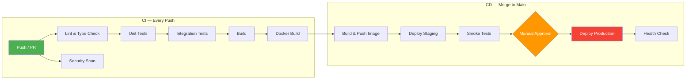

# Phase 6 — CI/CD Pipeline (Lean)

> Phase 6 of the GeoTrack Minimum Build System Workflow.
> Simplified from: Phase 16 (CI/CD & Release Engineering)

## Pipeline Architecture



---

## CI Pipeline (`.github/workflows/ci.yml`)

Runs on every push to `main`/`develop` and on PRs.

### Job Graph

```
lint ──────┬──→ build ──→ docker
           │
test ──────┘
           │
security ──┘
```

### Jobs

| Job | Runs After | Timeout | What It Does |
|-----|-----------|---------|-------------|
| **lint** | — | 5 min | ESLint + Prettier + `tsc --noEmit` |
| **test** | — | 10 min | Unit + integration tests with PostgreSQL + Redis services |
| **build** | lint, test | 5 min | `npm run build` (TypeScript compilation) |
| **docker** | build | 10 min | Build Dockerfile (no push, verify only) |
| **security** | lint | 5 min | `npm audit` + dependency scanning |

### CI Services

The test job spins up real PostgreSQL (with TimescaleDB) and Redis containers:

| Service | Image | Port |
|---------|-------|------|
| PostgreSQL | `timescale/timescaledb-ha:pg16` | 5432 |
| Redis | `redis:7-alpine` | 6379 |

### Caching Strategy

| Cache | Key | Saves |
|-------|-----|-------|
| npm dependencies | `hashFiles('package-lock.json')` | ~30s per job |
| Docker layers | GitHub Actions cache (GHA) | ~1-2 min on rebuild |

### Concurrency

- PR pushes cancel older running CI for the same branch
- Prevents wasted compute on rapid pushes

---

## CD Pipeline (`.github/workflows/cd.yml`)

Triggered on merge to `main` or manual dispatch.

### Steps

1. **Build & Push Image** — Docker image → GitHub Container Registry (`ghcr.io`)
2. **Deploy to Staging** — Automatic via `scripts/deploy.sh staging`
3. **Smoke Tests** — Health check against staging URL (5 retries)
4. **Deploy to Production** — Manual approval gate via GitHub Environment

### Image Tagging

| Tag | Example | Purpose |
|-----|---------|---------|
| Git SHA | `a1b2c3d` | Unique, immutable |
| Timestamp | `20260408-024500` | Human-readable |
| `latest` | `latest` | Rolling latest from main |

### Environments

| Environment | Deployment | Approval | URL |
|-------------|-----------|----------|-----|
| **staging** | Automatic on merge | None | `https://staging.geotrack.app` |
| **production** | Manual trigger | Required reviewer | `https://geotrack.app` |

> **Note**: Configure GitHub Environments at `Settings → Environments` to enable the approval gate for production.

---

## Branch Strategy — Trunk-Based Development

```
main ─────●────●────●────●────●────●──── (always deployable)
          │         │              │
          └──feat/─┘    └──fix/──┘
           (1-2 days)   (hours)
```

### Rules

| Rule | Description |
|------|-------------|
| **main = production** | Main branch is always deployable |
| **Short-lived branches** | Feature branches live 1-3 days max |
| **PR required** | All changes go through pull request |
| **CI must pass** | Cannot merge with failing CI |
| **Squash merge** | Clean linear history on main |

### Branch Naming Convention

```
feat/add-spatial-query      # New feature
fix/login-token-expiry      # Bug fix
chore/update-deps           # Maintenance
docs/api-versioning         # Documentation
refactor/geometry-service   # Code improvement
```

---

## Rollback Procedure

### Step-by-Step Rollback

```bash
# 1. Identify the last known-good image tag
# Check GitHub Actions → CD runs → find the last successful deployment

# 2. Roll back via deploy script
bash scripts/deploy.sh rollback production

# 3. Verify health
curl -sf https://geotrack.app/health

# 4. Investigate the failing deployment
git log --oneline -10  # Find the bad commit
```

### Rollback Decision Matrix

| Symptom | Action | Urgency |
|---------|--------|---------|
| Health check fails | Rollback immediately | 🔴 Critical |
| Error rate > 5% | Rollback, investigate | 🔴 Critical |
| Performance degraded | Monitor 5 min, then rollback | 🟡 High |
| Minor UI bug | Fix-forward with hotfix branch | 🟢 Normal |

### Database Rollback

> ⚠️ **Database migrations are forward-only.** Never delete or edit existing migration files.

If a deployment includes a bad migration:
1. Create a **new** migration that reverses the change
2. Deploy the reversal migration
3. Never use `prisma migrate reset` in production

---

## Secrets Management

### Required GitHub Secrets

| Secret | Used By | Description |
|--------|---------|-------------|
| `GITHUB_TOKEN` | CD | Automatic, used for GHCR push |

### Required GitHub Variables (per environment)

| Variable | Environment | Description |
|----------|------------|-------------|
| `STAGING_URL` | staging | Base URL for smoke tests |
| `PRODUCTION_URL` | production | Base URL for health checks |
| `DATABASE_URL` | both | PostgreSQL connection string |
| `JWT_SECRET` | both | JWT signing secret (≥ 32 chars) |
| `REDIS_HOST` | both | Redis hostname |

### Environment Variable Flow

```
.env.example          → Developer reference
.env                  → Local development (git-ignored)
GitHub Secrets        → CI/CD pipeline
Environment vars      → Container runtime
```

---

## Developer Tooling

### Makefile

```bash
make help           # Show all commands
make dev            # Start dev server
make test           # Run unit tests
make lint           # Lint & fix
make check          # Full quality check (lint + typecheck + test)
make ci             # Simulate full CI locally
make docker-build   # Build Docker image
make db-migrate     # Run migrations
make db-seed        # Seed data
make audit          # Security audit
```

### Simulate CI Locally

```bash
# Run the full CI pipeline on your machine before pushing
make ci
```

---

## Pipeline Timing Targets

| Stage | Target | Notes |
|-------|--------|-------|
| npm install (cached) | < 15s | npm ci with package-lock cache |
| Lint + Type check | < 30s | Parallel with tests |
| Unit tests (45 tests) | < 10s | No DB required |
| Integration tests | < 30s | With PostgreSQL service |
| Build | < 15s | TypeScript compilation |
| Docker build (cached) | < 60s | Multi-stage with layer cache |
| **Total CI** | **< 3 min** | With caching |
| Docker push | < 30s | To GHCR |
| Staging deploy | < 60s | Placeholder for now |
| **Total CD** | **< 5 min** | Build + deploy |

---

## Quality Gate Checklist

| Criterion | Status |
|-----------|--------|
| CI runs lint + tests + build on every push | ✅ Configured |
| CD deploys to staging on merge to main | ✅ Configured |
| Production deploy requires manual approval | ✅ GitHub Environment gate |
| Pipeline targets < 10 minutes | ✅ Target < 3 min (CI) |
| Rollback procedure documented | ✅ Step-by-step above |
| Branch strategy documented | ✅ Trunk-based |
| Secrets management documented | ✅ GitHub Secrets/Variables |

---

## Connection to Next Phase

**Phase 7 (Build: Vertical Slice → Full Implementation)** — Uses this pipeline to:
- Run CI on every feature branch push
- Auto-deploy vertical slice to staging on merge
- Validate E2E flows in staging before production
