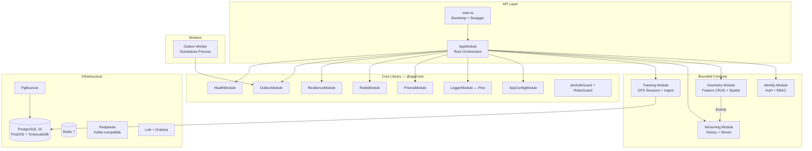

# GeoTrack System Review — April 2026

> **Scope**: Full-stack review of architecture, code quality, infrastructure, security, testing, and production readiness.
> **Codebase**: `c:\sources\personal-source\map-history` (NestJS modular monolith)

---

## 1. Architecture Overview



### Verdict: ✅ Solid Modular Monolith

| Aspect | Rating | Notes |
|---|---|---|
| Bounded Context isolation | ⭐⭐⭐⭐ | 4 modules, each with own DB schema. No cross-module imports. |
| DDD Layers | ⭐⭐⭐⭐ | `domain/` → `application/` → `infrastructure/` per module |
| Hexagonal Ports/Adapters | ⭐⭐⭐⭐ | Repository interfaces in `domain/`, Prisma implementations in `infrastructure/` |
| Event-Driven Communication | ⭐⭐⭐⭐ | Outbox pattern + EventEmitter for cross-module events |
| CQRS Separation | ⭐⭐⭐ | Separate query services exist but not full CQRS (no read models) |

---

## 2. Technology Stack Assessment

| Component | Version | Status | Notes |
|---|---|---|---|
| NestJS | **11.x** | ✅ Latest | Recently upgraded from v10 |
| Node.js | **20** | ✅ LTS | `.nvmrc` set, Dockerfile uses `node:20-alpine` |
| TypeScript | **5.7** | ✅ Latest | `strict: true` enabled |
| Prisma | **6.x** | ✅ Latest | With `postgresqlExtensions` preview |
| PostgreSQL | **16** | ✅ Latest | TimescaleDB HA image |
| PostGIS | **3.4** | ✅ | Managed via raw SQL migrations |
| TimescaleDB | ✅ | ✅ | Hypertables for location points |
| Redis | **7** | ✅ | Cache + Pub/Sub + Rate limit |
| Redpanda | latest | ✅ | Kafka-compatible, lighter for dev |
| Jest | **30.x** | ✅ | With ts-jest |
| ESLint | **9.x** | ✅ | Flat config (`eslint.config.mjs`) |
| Sentry | **10.x** | ✅ | APM + Profiling integration |

> [!TIP]
> The stack is modern and well-chosen. The use of Redpanda over Kafka for dev and TimescaleDB for time-series data are excellent production-grade decisions.

---

## 3. Module Deep-Dive

### 3.1 Identity Module

```
identity/
├── application/
│   ├── dtos/
│   ├── security/          ← Port interfaces (PasswordService, TokenService)
│   └── use-cases/
│       ├── register-user.use-case.ts
│       ├── login-user.use-case.ts
│       └── queries/identity-queries.service.ts
├── domain/
│   ├── entities/
│   └── repositories/      ← UserRepository port
├── infrastructure/
│   ├── persistence/        ← PrismaUserRepository
│   └── security/           ← BcryptPassword, NestJwtToken adapters
├── identity.controller.ts
└── identity.module.ts
```

**Strengths:**
- Clean separation of security concerns (`PasswordService`, `TokenService` as ports)
- JWT + Passport integrated correctly
- `JwtStrategy` registered and exported via `@app/core`

**Issues:**
> [!WARNING]
> - `expiresIn` cast with `as any` (line 34 of `identity.module.ts`) — type safety gap
> - No refresh token rotation logic visible in use cases (only `RefreshToken` model exists in schema)
> - No rate limiting on `/auth/login` specifically (global throttler applies, but brute-force needs stricter limits)

---

### 3.2 Geometry Module

```
geometry/
├── application/
│   ├── dtos/
│   └── use-cases/
│       ├── create-feature.use-case.ts
│       ├── update-feature.use-case.ts
│       ├── delete-feature.use-case.ts
│       └── queries/geometry-queries.interface.ts  ← CQRS read port
├── domain/
│   ├── entities/
│   └── repositories/feature.repository.ts         ← Write port
├── infrastructure/
│   └── persistence/
│       ├── prisma-feature.repository.ts
│       └── prisma-geometry-queries.ts             ← Read adapter
├── geometry.controller.ts  (GeometryController + SpatialController)
└── geometry.module.ts
```

**Strengths:**
- Excellent CQRS separation (`FEATURE_QUERIES` + `SPATIAL_QUERIES` as separate DI tokens)
- Optimistic concurrency control via `expectedVersion` on update/delete
- Outbox events for cross-module communication (`FeatureCreated`, `FeatureUpdated`)
- Swagger documentation on all endpoints

**Issues:**
> [!IMPORTANT]
> - `SpatialController` is in the same file as `GeometryController` — should be split for maintainability
> - No `GetFeatureUseCase` — the controller calls `featureQueries.getFeature()` directly, which is fine for CQRS reads but inconsistent with the use-case pattern on the write side
> - Missing `@ApiParam` decorator on `:id` routes

---

### 3.3 Versioning Module

```
versioning/
├── application/
│   ├── dtos/
│   └── use-cases/
│       ├── create-version.use-case.ts
│       ├── revert-feature.use-case.ts
│       └── queries/versioning-queries.service.ts
├── domain/
│   ├── entities/
│   └── repositories/feature-version.repository.ts
├── infrastructure/
│   └── persistence/prisma-feature-version.repository.ts
├── versioning.consumer.ts  ← Event listener (FeatureCreated/Updated)
├── versioning.controller.ts (VersioningController + FeatureVersionController)
└── versioning.module.ts
```

**Strengths:**
- Idempotent event processing via `InboxService.processOnce()`
- Version chain with `parentVersionId` for full history
- Changeset grouping for batch operations
- Clean event interface definitions

**Issues:**
> [!NOTE]
> - `VersioningConsumer` uses in-process `@OnEvent` — not Kafka/Redpanda. This means events are lost on crash. The Outbox pattern handles persistence, but the relay flow should be clarified.
> - No `FeatureDeleted` event handler — soft-deleted features don't get a version snapshot

---

### 3.4 Tracking Module

```
tracking/
├── application/
│   ├── commands/
│   ├── consumers/
│   ├── dtos/
│   ├── handlers/
│   └── use-cases/
│       ├── start-session.use-case.ts
│       ├── end-session.use-case.ts
│       ├── ingest-locations.use-case.ts
│       └── queries/tracking-queries.service.ts
├── domain/
│   ├── coordinates.vo.ts
│   ├── entities/
│   ├── repositories/
│   └── value-objects/
├── infrastructure/
│   ├── circuit-breaker.service.ts  ← LocationCacheService with Opossum
│   ├── persistence/
│   └── state-store.service.ts      ← Redis-backed state
├── interface/
│   └── ingest.controller.ts
├── tracking.controller.ts
└── tracking.module.ts
```

**Strengths:**
- Most mature module with proper CQRS (commands, handlers, consumers)
- Value Objects (`coordinates.vo.ts`) — true DDD
- Circuit breaker on location reads (Redis → Postgres fallback via Opossum)
- Redis state store for real-time tracking data
- Separate `TrackingIngestController` with `@Public()` for high-throughput IoT

**Issues:**
> [!WARNING]
> - `ingest.controller.ts` exists under `interface/` but `TrackingIngestController` is also in `tracking.controller.ts` — **potential duplicate or dead code**
> - Ingest endpoint is `@Public()` with comment "Auth via API key in production" — **API key auth middleware is not implemented**
> - `LocationCacheService` circuit breaker protects Postgres, but the log says "Redis circuit breaker OPEN" — **misleading log message** (the breaker wraps Postgres, not Redis)

---

## 4. Core Library (`@app/core`) Assessment

| Module | Purpose | Status |
|---|---|---|
| `AppConfigModule` | Env validation | ✅ |
| `LoggerModule` + `AppLoggerService` | Pino structured logging | ✅ |
| `PrismaModule` + `PrismaService` | DB connection lifecycle | ✅ |
| `RedisModule` | ioredis integration | ✅ |
| `ResilienceModule` | Retry + Timeout + Circuit Breaker | ✅ |
| `OutboxModule` + `InboxService` | Event-driven messaging | ✅ |
| `HealthModule` | Liveness + Readiness probes | ✅ |
| `HttpErrorFilter` | Global exception handling | ✅ |
| `JwtAuthGuard` + `RolesGuard` | Auth + RBAC | ✅ |
| `CorrelationIdMiddleware` | Request tracing | ✅ |
| `TimeoutInterceptor` | Global request timeout | ✅ |

> [!TIP]
> The core library is well-organized and covers all cross-cutting concerns. The global guard stack order (JwtAuth → Roles → Throttler) is correct.

---

## 5. Database & Schema Design

### Schema Isolation (Multi-Schema)
```
identity   → users, refresh_tokens, audit_log
geometry   → features, outbox, outbox_dlq
versioning → versions, changesets, inbox
tracking   → sessions, tracks, (location_points via raw SQL)
```

**Strengths:**
- ✅ Schema-per-bounded-context — excellent isolation
- ✅ Soft deletes on features (`is_deleted` + `deleted_at`)
- ✅ Optimistic locking via `current_version`
- ✅ Outbox + DLQ for reliable event delivery
- ✅ TimescaleDB hypertable for location points (raw SQL migration)
- ✅ Composite indexes designed for query patterns

**Issues:**

> [!CAUTION]
> - **`Outbox` and `OutboxDlq` are in the `geometry` schema** — they should be in a shared/infrastructure schema since the outbox pattern is cross-cutting
> - **`Inbox` is in the `versioning` schema** — same issue; inbox should be shared
> - **No FK from `Feature.createdBy/updatedBy` to `User.id`** — cross-schema FK is intentionally avoided (good for bounded context isolation), but no validation exists at the application level
> - **No `location_points` model in Prisma schema** — managed entirely via raw SQL. This is correct for TimescaleDB hypertables, but means Prisma offers zero type safety for location queries

---

## 6. Infrastructure & DevOps

### Docker Compose (Development)

| Service | Image | Notes |
|---|---|---|
| PostgreSQL | `timescale/timescaledb-ha:pg16` | PostGIS + TimescaleDB included |
| Redis | `redis:7-alpine` | 256MB max, LRU eviction |
| Redpanda | `redpandadata/redpanda:latest` | Kafka-compatible |
| PgBouncer | `edoburu/pgbouncer` | Transaction mode, 200→20 pool |
| Loki | `grafana/loki:2.9.4` | Log aggregation |
| Grafana | `grafana/grafana:10.3.1` | Dashboards |
| Redpanda Console | `redpandadata/console` | Kafka UI |

**Strengths:**
- ✅ All health checks configured with proper intervals
- ✅ PgBouncer for connection pooling (critical for production)
- ✅ Grafana auto-provisioning Loki datasource
- ✅ Chaos engineering overlay (`docker-compose.chaos.yml` with Toxiproxy)

**Issues:**
> [!WARNING]
> - `redpanda:latest` tag — should pin to a specific version for reproducibility
> - No Prometheus/metrics scraping service — `prom-client` is in `package.json` but no Prometheus instance in Docker Compose
> - Grafana has anonymous auth enabled and default `admin/admin` — acceptable for dev but ensure this never leaks to staging

### Dockerfile

**Strengths:**
- ✅ Multi-stage build (deps → build → base → api/worker)
- ✅ Non-root user (`geotrack:1001`)
- ✅ Separate targets for API and Worker
- ✅ Health check configured
- ✅ Prisma migrations run on startup (`prisma migrate deploy`)

**Issues:**
> [!NOTE]
> - `node:20-alpine` — should pin to a specific minor version (e.g., `node:20.19-alpine`) for reproducibility
> - No `.dockerignore` for `node_modules` verification needed — `.dockerignore` exists (150 bytes) but content not verified

### Kubernetes

**Strengths:**
- ✅ Full Kustomize structure (`base/` + `overlays/staging` + `overlays/production`)
- ✅ HPA with sensible thresholds (70% CPU, 80% memory, 2–10 replicas)
- ✅ Scale-down stabilization window (5 min) prevents flapping
- ✅ Zero-downtime deploys (`maxUnavailable: 0`, `maxSurge: 1`)
- ✅ Three-probe model (startup, liveness, readiness)
- ✅ Worker deployment with `Recreate` strategy (no parallel outbox relays)
- ✅ ServiceAccount configured

**Issues:**
> [!IMPORTANT]
> - No `PodDisruptionBudget` defined — could cause downtime during node drains
> - No `NetworkPolicy` — all pods can communicate freely
> - Worker has no health check — process liveness only. Consider adding a `/healthz` endpoint or using exec probes
> - `geotrack-api:latest` image tags — should use immutable SHA/version tags

### CI/CD

| Pipeline | Jobs | Duration Target |
|---|---|---|
| CI (`ci.yml`) | Lint → Test → Build → Docker → Security | < 5 min |
| CD (`cd.yml`) | (not reviewed) | — |

**Strengths:**
- ✅ Concurrency control (`cancel-in-progress: true`)
- ✅ Service containers for tests (Postgres + Redis)
- ✅ Coverage upload as artifact
- ✅ Security scan with `npm audit` + `audit-ci`
- ✅ Docker build caching via GHA cache

**Issues:**
> [!NOTE]
> - E2E tests (`test:e2e`) are not run in CI — only unit + integration
> - `continue-on-error: true` on `npm audit` and `audit-ci` — security findings don't fail the build
> - No SAST/DAST scanning beyond npm audit

---

## 7. Security Posture

| Control | Status | Details |
|---|---|---|
| Helmet headers | ✅ | Applied globally in `main.ts` |
| CORS | ✅ | Configurable via `CORS_ORIGINS` env |
| JWT Authentication | ✅ | Global `JwtAuthGuard` |
| RBAC | ✅ | Global `RolesGuard` with `@Roles()` decorator |
| Rate Limiting | ✅ | Global ThrottlerGuard (10/s, 100/min) |
| Input Validation | ✅ | `ValidationPipe` with whitelist + forbidNonWhitelisted |
| Password Hashing | ✅ | bcrypt via abstracted `PasswordService` port |
| SQL Injection | ⚠️ | Prisma handles most, but raw SQL queries need review |
| Request Tracing | ✅ | `CorrelationIdMiddleware` |
| Secrets Management | ✅ | K8s `Secret` resource, `.env` for dev |
| Error Masking | ✅ | `HttpErrorFilter` prevents stack trace leakage |

> [!CAUTION]
> **Critical Security Gap**: The tracking ingest endpoint (`POST /tracking/ingest`) is marked `@Public()` with a comment saying "Auth via API key in production — handled in middleware." **This middleware does not exist.** In the current state, anyone can push GPS data into the system without authentication.

---

## 8. Testing Coverage

| Test Type | Files | Status |
|---|---|---|
| Unit (`.spec.ts`) | Per use-case | ✅ `jest --testRegex='.*\.spec\.ts$'` |
| Integration (`.integration.spec.ts`) | `geometry`, `identity`, `tracking`, `versioning` | ✅ With service containers |
| E2E (`.e2e-spec.ts`) | `auth`, `feature-lifecycle`, `tracking` | ⚠️ Known regression (PrismaService teardown) |
| Container Setup | `setup-containers.ts` | ✅ TestContainers (TimescaleDB + Redpanda) |

**Strengths:**
- ✅ TestContainers for realistic integration testing
- ✅ Separate Jest configs for each test type
- ✅ `purgeData()` for fast state reset between tests

**Issues:**
> [!WARNING]
> - **E2E tests have a known regression**: `TypeError: Cannot read properties of undefined (reading '$executeRawUnsafe')` in teardown — PrismaService not available in `afterAll` (from conversation history)
> - `purgeData()` references tables `current_location, location_history` which may not match current schema names
> - E2E tests not included in CI pipeline
> - No load/performance tests exist despite high-throughput tracking ingest being a core feature

---

## 9. Prioritized Recommendations

### 🔴 Critical (Do Now)

| # | Issue | Module | Effort |
|---|---|---|---|
| 1 | **Implement API key auth middleware** for tracking ingest endpoint | Tracking | 2-4h |
| 2 | **Fix E2E test regression** — PrismaService teardown | Test | 1-2h |
| 3 | **Implement refresh token rotation** in Identity use cases | Identity | 4-6h |

### 🟡 Important (This Sprint)

| # | Issue | Module | Effort |
|---|---|---|---|
| 4 | Move `Outbox`/`OutboxDlq`/`Inbox` tables to a shared schema | Database | 2-3h |
| 5 | Add `PodDisruptionBudget` and `NetworkPolicy` to K8s | Infra | 1-2h |
| 6 | Pin Docker image tags (Redpanda, Node) to specific versions | Infra | 30m |
| 7 | Add Prometheus service to Docker Compose | Infra | 1h |
| 8 | Fix circuit breaker log message in `LocationCacheService` | Tracking | 15m |
| 9 | Add `FeatureDeleted` event handler in Versioning | Versioning | 2-3h |
| 10 | Enable E2E tests in CI pipeline | CI/CD | 1-2h |

### 🟢 Nice to Have (Backlog)

| # | Issue | Module | Effort |
|---|---|---|---|
| 11 | Split `SpatialController` to its own file | Geometry | 30m |
| 12 | Resolve `as any` type cast in JWT configuration | Identity | 15m |
| 13 | Add login-specific rate limiting (stricter than global) | Identity | 1h |
| 14 | Add load testing scripts for ingest endpoint (k6/artillery) | Testing | 4-6h |
| 15 | Create read models for full CQRS (denormalized views) | Geometry | 1-2 days |
| 16 | Verify `ingest.controller.ts` under `interface/` isn't dead code | Tracking | 15m |

---

## 10. Summary Scorecard

| Dimension | Score | Justification |
|---|---|---|
| **Architecture** | 🟢 8.5/10 | Clean modular monolith with DDD, Hexagonal, CQRS patterns |
| **Code Quality** | 🟢 8/10 | Strict TS, consistent patterns, good separation of concerns |
| **Infrastructure** | 🟢 8/10 | Production-grade Docker + K8s + PgBouncer + Observability |
| **Security** | 🟡 6.5/10 | Solid JWT/RBAC foundation but critical gap in ingest auth |
| **Testing** | 🟡 7/10 | Good structure but E2E broken, no load tests, gaps in CI |
| **DevOps/CI** | 🟢 8/10 | Full CI pipeline but E2E and security findings not blocking |
| **Documentation** | 🟢 8.5/10 | Extensive docs folder (9 design docs + ADRs + system knowledge) |
| **Overall** | **🟢 7.8/10** | **Production-capable with targeted fixes needed** |

> [!IMPORTANT]
> The system is architecturally sound and well-engineered. The most urgent action item is **securing the tracking ingest endpoint** — this is the only true production blocker. The E2E regression and refresh token implementation are close seconds. Everything else is hardening and polish.
